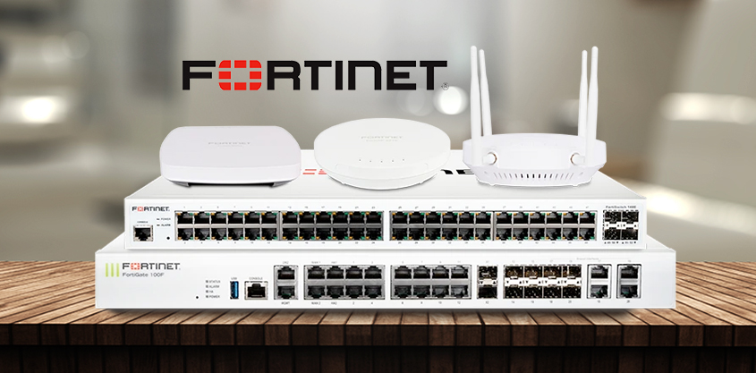

# Fortigate-Firewall
Explore the FortiGate Firewall Complete Guide a free, detailed collection of labs and practical knowledge built with dedication and real-world experience. Thank you for being part of the journey! 🚀🔥
 
# Topics to be covered:

---

| No | Name                                                                   |
| --- | ----------------------------------------------------------------------------|
| Module 1   | [**Introduction to Fortigate Firewall**](#introduction-to-fortigate-firewall) |
| Module 2   | [**Interface Configurations and Firewall Policies**](#interface-configurations-and-firewall-policies) | 
| Module 3   | [**High availability**](#high-availability) |
| Module 4   | [**Firewall Authentication**](#firewall-authentication) |
| Module 5   | [**Security Profiles**](#security-profiles) |
| Module 6   | [**Logging and Monitoring**](#logging-and-monitoring) |
| Module 7   | [**Basic IPSEC VPN**](#basic-ipsec-vpn) |
| Module 8   | [**SSL VPN**](#ssl-vpn)  Upcoming..| 
| Module 9   | [****](#Upcoming) Upcoming.. |


---

# MODULE 1
## Introduction to Fortigate Firewall



## Table of Contents: 

1. **Understanding Features of FortiGate** - FortiGate firewall එකේ ප්‍රධාන security features සහ capabilities තේරුම් ගැනීම. (Firewall, IPS, VPN, Antivirus, Web Filtering, Application Control වැනි features)

2. **FortiGuard Queries & Packages** - FortiGuard service එකෙන් ලබාගන්න threat intelligence, security updates සහ protection databases පිළිබඳ අවබෝධය. (Updates, signatures, antivirus definitions, IPS updates වැනි දේවල්)

3. **UTM Firewall Features** - Unified Threat Management firewall එකක features සහ FortiGate UTM firewall එකක් ලෙස ක්‍රියා කරන ආකාරය. (Multiple security functions එකම platform එකකින් ලබාදීම)

4. **Platform Design and Architecture** - FortiGate hardware/software design එක, internal architecture එක සහ traffic processing ක්‍රියාවලිය තේරුම් ගැනීම.

5. **About CLI** - FortiGate Command Line Interface (CLI) පිළිබඳ අවබෝධය. Commands භාවිතා කර configuration, troubleshooting සහ management කිරීම.

6. **Getting Management GUI Access** - FortiGate Web-based GUI access ලබා ගැනීම සහ initial management configuration කිරීම.

7. **About Administration Profiles** - FortiGate administrator accounts සඳහා permissions සහ access levels configure කිරීම. (කවුද මොන settings බලන්න/වෙනස් කරන්න පුළුවන්ද කියන control එක)


# I. Understanding the Features of FortiGate:

FortiGate කියන්නේ Fortinet විසින් නිර්මාණය කරන ලද network security appliance එකක්.
මෙය network එක විවිධ security threats වලින් ආරක්ෂා කිරීම සඳහා firewall, VPN, IPS, antivirus වැනි security features ගණනාවක් ලබා දෙයි.

- **Firewall**:Network එකට එන සහ පිටවන traffic control කිරීම සඳහා භාවිතා කරන security system එකක්. Predefined rules අනුව traffic allow හෝ block කරයි.

- **Intrusion Prevention System (IPS)**:Network එක තුළ සිදුවන malicious activities සහ attacks හඳුනාගෙන ඒවා block කරන security feature එකක්.

- **Virtual Private Network (VPN)**:Internet වැනි secure නොවන network හරහා users හෝ remote locations අතර ආරක්ෂිත connection එකක් නිර්මාණය කරයි.

- **Antivirus and Antimalware**:Virus, malware, spyware වැනි harmful software හඳුනාගෙන network එකට ඇතුල් වීම වැළැක්වීමට භාවිතා කරයි.

- **Web Filtering**:Users ලා access කරන websites control කිරීමට භාවිතා කරයි. Unsafe හෝ unwanted websites block කිරීමට උපකාරී වේ.

- **Application Control**:Network එක තුළ භාවිතා වන applications හඳුනාගෙන ඒවා allow, block හෝ limit කිරීමට හැකියාව ලබා දෙයි.

- **Data Loss Prevention (DLP)**:Company එකේ වැදගත් සහ confidential data unauthorized ලෙස පිටතට යාම වැළැක්වීමට භාවිතා කරයි.

- **Advanced Threat Protection (ATP)**:Advanced attacks සහ unknown threats හඳුනා ගැනීම සඳහා sandboxing සහ behavior analysis වැනි techniques භාවිතා කරයි.

- **Traffic Shaping and Quality of Service (QoS)**:Network bandwidth manage කරමින් වැදගත් applications සඳහා priority ලබා දී performance වැඩි කරයි.

- **Logging and Reporting**:Network activities, security events සහ policy violations record කර reports ලබා දෙයි. Troubleshooting සහ security monitoring සඳහා උපකාරී වේ.

# II. FortiGuard Queries & Packages

FortiGuard is a comprehensive security intelligence service provided by Fortinet that offers real-time updates and protection against emerging threats for Fortinet products, including FortiGate. FortiGuard queries and packages play a crucial role in keeping security solutions up-to-date and effective. Here's a detailed explanation:

## FortiGuard Queries

**FortiGuard කියන්නේ Fortinet security products (උදාහරණයක් ලෙස FortiGate) සමඟ සම්බන්ධ වන security intelligence service එකක්.**
මෙය network security වැඩි දියුණු කිරීම සඳහා latest threat information, security updates සහ protection databases ලබා දෙයි.

- **Real-time Threat Intelligence**:
  FortiGuard Labs වෙතින් නව security threats පිළිබඳ real-time information ලබා දෙයි.
  අලුත් malware, vulnerabilities, zero-day attacks වැනි threats හඳුනා ගැනීමට උපකාරී වේ.

- **URL Filtering Updates**:
  Web filtering සඳහා භාවිතා කරන website databases update කරයි.
  Malicious හෝ unwanted websites හඳුනාගෙන block කිරීමට සහ accurate website categorization ලබා දීමට උපකාරී වේ.

- **Antivirus and Antimalware Definitions**:
  Antivirus සහ antimalware databases update කරයි.
  අලුත් virus, worms, Trojans සහ spyware වැනි threats හඳුනාගෙන block කිරීමට FortiGate එකට හැකියාව ලබා දෙයි.

- **IPS Signatures**:
  IPS signatures update කරයි.
  Network attacks, exploits, vulnerabilities සහ suspicious traffic patterns හඳුනාගෙන block කිරීමට උපකාරී වේ.

- **Application Control Updates**:
  Application Control සඳහා අවශ්‍ය updates ලබා දෙයි.
  FortiGate එකට network එකේ භාවිතා වන applications හඳුනාගෙන ඒවා control කිරීමට උපකාරී වේ.

- **DLP Definitions**:
  Data Loss Prevention සඳහා අවශ්‍ය definitions update කරයි.
  Credit card numbers, confidential data සහ sensitive information වැනි දේවල් network එකෙන් unauthorized ලෙස පිටතට යාම වැළැක්වීමට භාවිතා කරයි.

## FortiGuard Packages

**FortiGuard Packages කියන්නේ Fortinet විසින් ලබාදෙන security updates, threat intelligence feeds සහ security definitions එකතු කර ඇති packages.**
මෙම packages මගින් FortiGate වැනි security solutions latest threats වලට ආරක්ෂා වීමට අවශ්‍ය updates සහ protection information ලබා ගනී.

* **Comprehensive Security Updates:**
  FortiGuard packages මගින් antivirus, IPS, application control, web filtering සහ DLP වැනි security features සඳහා updates ලබා දෙයි.
  මෙම updates නිතර ලබාදීම නිසා අලුත් security threats වලට එරෙහිව ආරක්ෂාව වැඩි වේ.

* **Automatic Delivery:**
  FortiGuard packages automatically Fortinet security devices වෙත ලබා දේ.
  Administrator විසින් manually update කිරීමට අවශ්‍ය නොවන අතර, system එක latest security information සමඟ update වෙයි.

* **Continuous Monitoring and Research:**
  FortiGuard packages පිටුපස FortiGuard Labs ක්‍රියා කරයි.
  එය ලෝකය පුරා ඇති security threats monitor කරමින් research කර අලුත් updates සහ threat intelligence develop කරයි.

* **Customization and Configuration:**
  Organization එකේ අවශ්‍යතා අනුව FortiGuard updates configure කළ හැක.
  Administrators ලාට update schedule, අවශ්‍ය update components සහ critical updates prioritize කිරීමට හැකියාව ඇත.

* **Integration with Security Fabric:**
  FortiGuard packages Fortinet Security Fabric සමඟ integrate වේ.
  එමගින් Fortinet security products අතර threat information share කර coordinated security response එකක් ලබා දෙයි.

# III. Understanding UTM (Unified Threat Management) Firewalls and FortiGate

**UTM (Unified Threat Management) Firewall කියන්නේ security features ගණනාවක් එකම device එකක් තුළ එකතු කර ඇති firewall solution එකක්.**
FortiGate මෙවැනි UTM firewall එකක් ලෙස හඳුන්වන්නේ firewall, VPN, IPS, antivirus, web filtering වැනි security functions එකම platform එකක ලබා දෙන නිසාය.

## Why FortiGate is a UTM Firewall?

* **Centralized Management:**
  FortiGate මගින් security policies, configurations සහ monitoring එකම interface එකකින් manage කළ හැක.
  එමගින් network management පහසු වන අතර complexity අඩු වේ.

* **Streamlined Deployment:**
  වෙන වෙනම security devices භාවිතා කිරීම වෙනුවට FortiGate එකකින් security functions ගණනාවක් ලබා ගත හැක.
  එමගින් hardware cost, space සහ deployment complexity අඩු වේ.

* **Improved Performance:**
  Security features එකම platform එකක integrate කර ඇති නිසා resources හොඳින් භාවිතා කර efficient performance එකක් ලබා දෙයි.

* **Holistic Security Posture:**
  Firewall, VPN, IPS, antivirus, web filtering සහ application control වැනි security features එකට එකතු කර comprehensive protection එකක් ලබා දෙයි.

---

# UTM Firewall Features

* **Firewall:**
  Network traffic monitor කර predefined rules අනුව allow හෝ block කරයි.
  Application level දක්වා traffic inspect කර වැඩි control එකක් ලබා දෙයි.

* **Intrusion Prevention System (IPS):**
  Network attacks, exploits, vulnerabilities සහ suspicious activities හඳුනාගෙන block කරයි.

* **Virtual Private Network (VPN):**
  Internet වැනි untrusted networks හරහා secure communication සඳහා encrypted connection එකක් ලබා දෙයි.

* **Antivirus and Antimalware:**
  Virus, worms, Trojans, spyware වැනි malware හඳුනාගෙන block කරයි.

* **Web Filtering:**
  Websites categories, URLs හෝ keywords අනුව access control කර malicious websites block කරයි.

* **Application Control:**
  Network එකේ භාවිතා වන applications හඳුනාගෙන allow, block හෝ limit කිරීමට හැක.

* **Data Loss Prevention (DLP):**
  Sensitive data unauthorized ලෙස network එකෙන් පිටතට යාම වැළැක්වීමට භාවිතා කරයි.

* **Advanced Threat Protection (ATP):**
  Sandboxing සහ behavior analysis භාවිතා කර zero-day attacks සහ advanced threats හඳුනාගෙන block කරයි.

* **Traffic Shaping and Quality of Service (QoS):**
  Network bandwidth manage කර critical applications සඳහා priority ලබා දෙයි.

* **Logging and Reporting:**
  Network activities, security events සහ policy violations record කර reports ලබා දෙයි.
  Security analysis, troubleshooting සහ compliance සඳහා උපකාරී වේ.

# **IV. FortiGate Firewall Platform Design and Architecture**

**FortiGate කියන්නේ advanced network security සහ high performance ලබාදීම සඳහා නිර්මාණය කර ඇති next-generation firewall platform එකක්.**
එහි architecture එක විවිධ components එකට එකතු වී ක්‍රියා කරන ආකාරයෙන් සැකසී ඇති අතර, advanced threat protection, network segmentation සහ secure connectivity වැනි පහසුකම් ලබා දෙයි.

**FortiGate architecture එකේ එක් එක් component වල කාර්යභාරය තේරුම් ගැනීම වැදගත් වේ.**


## 1. Processing Units

### a. CPU (Central Processing Unit)

**CPU කියන්නේ FortiGate එකේ ප්‍රධාන processing unit එකයි.**
එය firewall operations, packet processing සහ විවිධ security services ක්‍රියාත්මක කිරීම සඳහා වගකියයි.

**FortiGate තුළ multi-core CPUs භාවිතා කරන අතර, ඒ මගින් වැඩි traffic volume එකක් සහ complex security functions efficiently handle කිරීමට හැකියාව ලැබේ.**

### b. NP (Network Processor)

**FortiGate තුළ FortiASIC NP6 සහ NP7 වැනි specialized network processors ඇතුළත් වේ.**
මෙම processors මගින් packet forwarding, encryption/decryption සහ content processing වැනි වැඩ CPU එකෙන් ඉවත් කර වේගවත් ලෙස process කරයි.

**මෙම NP chips භාවිතා කිරීමෙන් FortiGate firewall performance වැඩි වන අතර, වැඩි traffic load සහ scalable network environments handle කිරීමට හැකියාව ලැබේ.**

## 2. Security Services

### a. Firewall

**Firewall component එක මගින් predefined security rules අනුව network traffic inspect සහ filter කරයි.**
එමගින් අවසර ලත් (authorized) traffic පමණක් network එක හරහා යාමට ඉඩ ලබා දෙන අතර, අනවශ්‍ය හෝ අවදානම් traffic block කරයි.

### b. IPS (Intrusion Prevention System)

**IPS module එක මගින් network traffic patterns, signatures සහ abnormal behaviors analyze කරමින් known සහ unknown attacks හඳුනාගෙන block කරයි.**
එමගින් exploits, malware සහ vulnerabilities වලින් network එක ආරක්ෂා කිරීමට උපකාරී වේ.

### c. VPN (Virtual Private Network)

**FortiGate මගින් IPsec, SSL සහ L2TP වැනි විවිධ VPN technologies support කරයි.**
එමගින් Internet වැනි secure නොවන networks හරහා remote sites, users සහ partners අතර ආරක්ෂිත communication channels (encrypted connections) නිර්මාණය කරයි.

### d. Antivirus and Antimalware

**FortiGate තුළ antivirus සහ antimalware services ඇතුළත් වේ.**
එමගින් viruses, worms, Trojans සහ spyware වැනි malicious software හඳුනාගෙන block කර network එකට ඇතුල් වීම සහ පැතිරීම වැළැක්වීමට උපකාරී වේ.

### e. Web Filtering

**Web filtering feature එක මගින් categories, URLs හෝ keywords අනුව websites access control කරයි.**
එමගින් organizations වලට acceptable use policies enforce කිරීමට, malicious websites block කිරීමට සහ user productivity වැඩි කිරීමට උපකාරී වේ.

### f. Application Control

**FortiGate application control feature එක මගින් network එක තුළ භාවිතා වන විවිධ applications හඳුනාගෙන ඒවා control කරයි.**
එමගින් administrators ලාට specific applications සඳහා allow, deny හෝ access limit කිරීමේ policies සකස් කිරීමට හැකියාව ලැබේ.

### g. DLP (Data Loss Prevention)

**DLP (Data Loss Prevention) functionality එක මගින් sensitive data unauthorized ලෙස network එකෙන් පිටතට යාම වැළැක්වීමට උපකාරී වේ.**
එය outgoing traffic inspect කර credit card numbers, confidential information සහ intellectual property වැනි predefined data patterns හඳුනාගෙන data leakage වැළැක්වීමට ක්‍රියා කරයි.

### h. ATP (Advanced Threat Protection)

**FortiGate මගින් sandboxing සහ behavior-based analysis වැනි advanced threat protection mechanisms භාවිතා කරයි.**
එමගින් zero-day exploits සහ targeted attacks වැනි sophisticated threats හඳුනාගෙන block කිරීමට හැකියාව ලැබේ.

## 3. Networking Components

### a. Interfaces

**FortiGate තුළ physical සහ virtual network interfaces ඇතුළත් වේ.**
මෙම interfaces මගින් විවිධ network segments සමඟ සම්බන්ධ වීමට හැකි අතර, traffic ingress/egress control කිරීම සහ network segmentation සිදු කර security සහ performance optimize කිරීමට උපකාරී වේ.

### b. Routing

**FortiGate මගින් dynamic සහ static routing protocols support කරයි.**
එමගින් විවිධ network segments අතර traffic efficiently සහ securely route කිරීමට හැකියාව ලැබේ.
මෙය optimal network performance සහ reliable connectivity පවත්වා ගැනීමට උපකාරී වේ.

### c. VLANs (Virtual Local Area Networks)

**VLANs මගින් FortiGate එකට network එක multiple virtual LANs ලෙස segment කිරීමට හැකියාව ලබා දෙයි.**
එමගින් traffic එක වෙන වෙනම isolate කර security, scalability සහ performance වැඩි කිරීමට උපකාරී වේ, විශේෂයෙන් large සහ complex networks වලදී.

## 4. Management and Reporting

### a. Management Interface

**FortiGate මගින් web-based management interface, Command Line Interface (CLI) සහ centralized management platform (FortiManager) ලබා දෙයි.**
එමගින් firewall policies, security services සහ network settings configure කිරීම, monitor කිරීම සහ manage කිරීම පහසු වේ.

### b. Logging and Reporting

**FortiGate මගින් network activity, security events සහ policy violations logs කරයි.**
එමගින් administrators ලාට security incidents analyze කිරීමට, troubleshooting කිරීමට සහ regulatory compliance maintain කිරීමට අවශ්‍ය detailed reports සහ alerts ලබා දෙයි.

**FortiGate platform design සහ architecture එක මෙම සියලු components එකට එකතු කර භාවිතා කරයි.**
එමගින් modern enterprise environments සඳහා strong network security, high performance සහ scalability ලබා දීමට හැකියාව ලැබේ.

## **Three Families of Fortinet SPUs(Security Processing Units):**

1. **NETWORK PROCESSOR 7 (NP7)**
2. **CONTENT PROCESSOR 9 (CP9)**
3. **SECURITY PROCESSING UNIT (SP5)**


Link: [https://www.fortinet.com/products/fortigate/fortiasic](https://www.fortinet.com/products/fortigate/fortiasic)

# **V. FortiGate Firewall CLI**

**FortiGate firewall Command Line Interface (CLI) කියන්නේ administrators ලාට firewall එක configure කිරීම, monitor කිරීම සහ troubleshooting කිරීම සඳහා ලබාදෙන powerful සහ flexible tool එකක්.**
CLI මගින් commands භාවිතා කර FortiGate settings manage කිරීමට සහ system operations control කිරීමට හැකියාව ලැබේ.

## Overview of FortiGate CLI

**CLI access කිරීම සඳහා SSH හෝ firewall device එකට direct connect කර ඇති console port එක භාවිතා කළ හැක.**
මෙය text-based interface එකක් වන අතර, administrators ලාට commands execute කර firewall configuration සහ management tasks සිදු කිරීමට හැකියාව ලබා දෙයි.

## Key Features and Functions

### 1. Configuration Management

- **Configuration Hierarchy**:
  FortiGate CLI එක hierarchical structure එකක් අනුගමනය කරයි.
  එහි configuration settings විවිධ levels ලෙස organize කර ඇති අතර, system, interface, firewall policy වැනි nested sections තුළ settings manage කරයි.
- **Configuration Commands**: Administrators can use CLI commands to view, modify, and commit configuration changes. Commands include `show`, `get`, `set`, `edit`, `delete`, `execute`, and `end`.

### 2. Monitoring and Troubleshooting

- **Status Monitoring:**
  FortiGate CLI commands මගින් system status, interface statistics, CPU සහ memory usage, VPN connections වැනි තොරතුරු real-time monitor කිරීමට හැකියාව ලබා දෙයි.
  එමගින් administrators ලාට device performance සහ network status පරීක්ෂා කර troubleshooting කිරීමට උපකාරී වේ.
- **Diagnostic Tools**: FortiGate CLI includes diagnostic tools such as `ping`, `traceroute`, `diag sniff`, and `diag debug` commands to troubleshoot network connectivity issues and analyze traffic flow.

### 3. Security Policy Management

- **Firewall Policies:**
  FortiGate CLI commands භාවිතා කර administrators ලාට firewall policies create සහ manage කිරීමට හැකියාව ඇත.
  එමගින් source/destination IP, port, protocol සහ security profiles අනුව විවිධ network segments අතර traffic flow control කරයි.
- **Security Profiles:**
  FortiGate CLI මගින් antivirus, IPS, web filtering සහ application control වැනි security profiles configure කිරීමට හැකියාව ඇත.
  එමගින් security policies enforce කර network එක විවිධ threats වලින් ආරක්ෂා කිරීමට උපකාරී වේ.

### 4. VPN Configuration

- **VPN Tunnels:**
  FortiGate CLI commands මගින් administrators ලාට IPsec, SSL සහ වෙනත් VPN tunnels configure කිරීමට හැකියාව ඇත.
  එමගින් remote sites, users සහ partners අතර secure communication channels (encrypted connections) නිර්මාණය කරයි.

- **VPN Monitoring:**
  CLI commands භාවිතා කර VPN connections monitor කිරීම, tunnel status බලීම සහ VPN සම්බන්ධ troubleshooting සිදු කිරීම සඳහා හැකියාව ලබා දෙයි.

### 5. System Administration

- **System Configuration:**
  FortiGate CLI මගින් hostname, time zone, DNS, NTP, SNMP, logging සහ administrative access controls වැනි system settings configure කිරීමට හැකියාව ඇත.
  එමගින් FortiGate device එකේ basic system operations සහ management settings control කරයි.

- **User Management:**
  CLI commands භාවිතා කර administrators ලාට user accounts, authentication methods සහ access permissions manage කිරීමට හැකියාව ඇත.
  එමගින් users ලාගේ access control සහ security permissions නිසි ලෙස configure කළ හැක.

## Advantages of FortiGate CLI

- **Granular Control:**
  FortiGate CLI මගින් firewall configuration settings වලට detailed level control එකක් ලබා දෙයි.
  එමගින් administrators ලාට අවශ්‍යතා අනුව specific configurations customize කිරීමට හැකියාව ඇත.

- **Scripting and Automation:**
  CLI commands shell scripts හෝ automation tools සමඟ භාවිතා කර automate කළ හැක.
  එමගින් bulk configuration changes සහ නැවත නැවත සිදු කරන tasks පහසු කර time save කරයි.

- **Direct Access:**
  CLI මගින් GUI භාවිතා නොකර firewall configuration වෙත direct access ලබා දේ.
  එය advanced users සහ troubleshooting අවස්ථා සඳහා ඉතා ප්‍රයෝජනවත් වේ.

# VI. Getting Management GUI Access of FortiGate Firewall

**FortiGate firewall එකේ management GUI (Graphical User Interface) access ලබා ගැනීම මගින් administrators ලාට web-based interface එකක් භාවිතා කර firewall එක configure සහ manage කිරීමට හැකියාව ලැබේ.**

**මෙම GUI access මගින් firewall policies, security settings සහ network configurations පහසුවෙන් manage කළ හැක.**

 1. Connect to the FortiGate Firewall

**පළමුව FortiGate firewall එකට connection එකක් establish කළ යුතුය.**
මෙය firewall device එකට direct connect කර ඇති console port එක හරහා හෝ remote access enable කර ඇති අවස්ථාවක SSH (Secure Shell) භාවිතා කර සිදු කළ හැක.

```markdown

# Example SSH command to connect to the FortiGate firewall
ssh admin@<firewall_ip_address>
```

## 2. Enable Management Access

**FortiGate firewall එකේ management access enable කර ඇති බව තහවුරු කළ යුතුය.**
සාමාන්‍යයෙන් FortiGate හි management GUI access සඳහා HTTPS (HTTP over SSL) access එක port 443 මත enable කර ඇත.

```
# Example command to enable HTTPS access
config system settings
    set admin-https-ssl-port 443
    set gui-mgmt https
    end

```

## 3. Configure Administrative Access

**Management GUI එකට login වීම සඳහා administrative access credentials configure කළ යුතුය.**
Admin user එකට firewall එක access කිරීමට සහ manage කිරීමට අවශ්‍ය නිසි privileges (permissions) ලබා දී ඇති බව තහවුරු කළ යුතුය.

```
# Example command to configure administrative access
config system admin
    edit admin
        set password <admin_password>
    next
end

```

## 4. Access the Management GUI

**Management access enable කරලා administrative credentials configure කළ පසු, web browser එකක් භාවිතා කර FortiGate management GUI වෙත access කළ හැක.**
Browser address bar එකේ FortiGate firewall එකේ IP address එක enter කර, configured administrative credentials භාවිතා කර login විය හැක.

```
https://<firewall_ip_address>

```

## Additional Considerations

* **Firewall Rules:**
  Management interface එකට traffic allow කරන firewall rules තිබෙන බව තහවුරු කළ යුතුය.
  සාමාන්‍යයෙන් HTTPS management access සඳහා port 443 භාවිතා වන අතර, අවශ්‍ය IP addresses හෝ networks වලින් GUI access ලබා දිය යුතුය.

* **Security:**
  Administrative access සඳහා strong සහ unique passwords භාවිතා කළ යුතුය.
  Security වැඩි කිරීම සඳහා passwords නිතර update කිරීම වැදගත් වේ.

* **Logging and Monitoring:**
  Management GUI access monitor කර logging enable කළ යුතුය.
  එමගින් administrative activities track කර auditing සහ security monitoring සඳහා භාවිතා කළ හැක.

## **Demo:**


Default Username: admin

Password: <empty hit enter>

Configure the new strong Password

**Sample Topology:**


**Initial CLI Conifguration for GUI access:**


**Taking GUI Admin Access:      http://105.0.0.254**


**Changing Firewall Hostname:   FGT**


**Welcome to Fortigate Firewall Dashboard**


# **VII. Administration Profiles in FortiGate Firewall**

**FortiGate firewall එකේ Administration Profiles මගින් administrative access සහ privileges manage කිරීමට flexible method එකක් ලබා දෙයි.**
එමගින් විවිධ users හෝ groups සඳහා specific permissions සහ restrictions define කළ හැකි අතර, firewall එක secure සහ efficient ලෙස manage කිරීමට උපකාරී වේ.

**Administration Profiles මගින් කවුද මොන settings බලන්නද, වෙනස් කරන්නද කියන access control එක නිසි ලෙස manage කළ හැක.**

## Overview

**Administration profiles කියන්නේ administrators හෝ administrative groups සඳහා access rights සහ capabilities define කරන templates වැනි දෙයක්.**
එක් එක් profile එක මගින් firewall functionalities වලට ලබාදෙන access level එක තීරණය කරයි.

**මෙයට configuration, monitoring සහ management tasks සඳහා users ලාට ලබාදෙන permissions ඇතුළත් වේ.**

## Key Components

### 1. Access Controls

* **Permissions:**
  Administration profiles මගින් firewall functionalities සඳහා permissions define කරයි.
  ඒවාට configuration changes, system settings, security policies සහ VPN configurations වැනි areas සඳහා access control ඇතුළත් වේ.

* **Granularity:**
  Administration profiles මගින් detailed level access controls configure කළ හැක.
  එමගින් administrators ලාගේ roles සහ responsibilities අනුව specific permissions assign කිරීමට හැකියාව ලැබේ.

### 2. User Authentication
* **Authentication Methods:**
  Administration profiles මගින් administrators ලාගේ identity verify කිරීම සඳහා භාවිතා කරන authentication methods define කරයි.
  ඒවාට local authentication, RADIUS, LDAP සහ TACACS+ වැනි methods ඇතුළත් වේ.

* **Authentication Servers:**
  Profiles මගින් users authenticate කිරීම සඳහා multiple authentication servers configure කළ හැක.
  එමගින් redundancy සහ flexible authentication management ලබා ගත හැක.
  
### 3. Administrative Privileges
* **Role-based Access:**
  Administration profiles මගින් role-based access control (RBAC) support කරයි.
  එමගින් administrators ලාට ඔවුන්ගේ roles අනුව වෙනස් වෙනස් privilege levels assign කිරීමට හැකියාව ලැබේ.

* **Super Administrators:**
  Super administrators ලාට firewall එකේ සියලුම functionalities සහ settings සඳහා full access (unrestricted access) ඇත.
  අනෙක් administrators ලාට ඔවුන්ට assign කර ඇති administration profile අනුව limited privileges පමණක් ලබා දේ.

### 4. Session Management

* **Session Limits:**
  Administration profiles මගින් එක් එක් user හෝ group සඳහා එකවර open කළ හැකි administrative sessions ගණන limit කළ හැක.
  එමගින් excessive access sessions control කර security වැඩි කරයි.

* **Timeouts:**
  Profiles මගින් inactive administrators automatically logout කිරීමට session timeout settings configure කළ හැක.
  එමගින් security වැඩි වන අතර system resources නිසි ලෙස manage කිරීමට උපකාරී වේ.

## Configuration and Management

### 1. Profile Creation

* **Creation:**
  Administration profiles FortiGate firewall එකේ web-based management GUI හෝ Command Line Interface (CLI) භාවිතා කර create සහ configure කළ හැක.

* **Naming Conventions:**
  Profiles සඳහා unique names ලබා දෙන අතර, එමගින් profiles පහසුවෙන් identify කර manage කිරීමට හැකියාව ලැබේ.

### 2. Profile Assignment

* **Assignment to Administrators:**
  Administration profiles create කළ පසු, administrators හෝ administrative groups වල roles සහ responsibilities අනුව ඒවා assign කරයි.
  එමගින් එක් එක් administrator ට අවශ්‍ය access level එක ලබා දිය හැක.

* **Multiple Profiles:**
  Complex access requirements සඳහා administrators ලාට multiple administration profiles assign කළ හැක.
  එමගින් විවිධ permissions සහ access levels එකට manage කිරීමට හැකියාව ලැබේ.

## Demo:

**Click on Administrator: System —> Administrator**


**By default Super_Admin** 


**Set the username/password  also select as a Local user:** 


**Create the new Administrator Profile for the new user**


**Select the Permission Which you want to give and click Ok.**

Note:

**Idle Timeout Period කියන්නේ administrator කෙනෙක් GUI එකට login වී කිසිදු activity එකක් නොකර සිටින විට, session එක active ලෙස පවතින කාලයයි.**

මෙය භාවිතා කරන්නේ management PC එක unattended ලෙස තබා ගිය අවස්ථාවක වෙනත් කෙනෙකුට FortiGate access කිරීම වැළැක්වීමටයි.

**FortiGate default idle timeout value එක සාමාන්‍යයෙන් මිනිත්තු 5ක් වේ.**
එම කාලය තුළ කිසිදු activity එකක් නොමැති නම් administrator session එක automatically logout වේ.


**Select newly created Profile and Click OK.**


**Newly created Admin :**


**Administrator Profile Hierachy:**


### **Summary:**
**මෙම module එක මගින් FortiGate firewall පිළිබඳ මූලික හැඳින්වීමක් ලබා දෙන අතර, FortiGate product එකේ ප්‍රධාන කරුණු කිහිපයක් ආවරණය කරයි.**

1. **Understanding Features of FortiGate:**
   FortiGate firewall එකේ ප්‍රධාන features සහ capabilities පිළිබඳ විස්තර කරයි.
   එහි advanced threat protection, network segmentation සහ secure connectivity වැනි security capabilities පැහැදිලි කරයි.

2. **FortiGuard Queries & Packages:**
   FortiGuard services පිළිබඳ අවබෝධයක් ලබා දෙයි.
   Fortinet මගින් ලබාදෙන threat intelligence සහ security updates භාවිතා කර firewall එකේ threat detection සහ prevention capabilities වැඩි කරන ආකාරය පැහැදිලි කරයි.

3. **UTM Firewalls Features:**
   FortiGate UTM (Unified Threat Management) firewall එකක් ලෙස ලබාදෙන features පිළිබඳ විස්තර කරයි.
   Firewall, IPS, Antivirus, Web Filtering සහ Application Control වැනි security features එකම platform එකකින් ලබා දෙන ආකාරය පැහැදිලි කරයි.

4. **Platform Design and Architecture:**
   FortiGate firewall එකේ design සහ architecture පිළිබඳ අවබෝධයක් ලබා දෙයි.
   Processing units, security services, networking components සහ management features ක්‍රියා කරන ආකාරය පැහැදිලි කරයි.

5. **About CLI:**
   FortiGate Command Line Interface (CLI) පිළිබඳ හැඳින්වීමක් ලබා දෙයි.
   Text-based commands භාවිතා කර firewall configure කිරීම, monitor කිරීම සහ troubleshooting කිරීම සඳහා CLI භාවිතා කරන ආකාරය පැහැදිලි කරයි.

6. **Getting Mgmt GUI Access:**
   FortiGate management GUI (Graphical User Interface) access ලබා ගැනීමේ ක්‍රියාවලිය පැහැදිලි කරයි.
   Web-based interface එක භාවිතා කර firewall configure සහ manage කරන ආකාරය මෙහිදී ඉගෙන ගනී.

7. **About Administration Profiles:**
   FortiGate administration profiles පිළිබඳ විස්තර කරයි.
   Administrators හෝ administrative groups සඳහා access rights සහ privileges define කර secure සහ efficient firewall management ලබා දෙන ආකාරය පැහැදිලි කරයි.

---

<br>

**[⬆ Back to Top](#topics-to-be-covered)**

# MODULE 2
## Interface Configurations and Firewall Policies


### **Table of Contents:**

* **Basic Interface Configuration:**
  FortiGate network interfaces configure කිරීම පිළිබඳව ඉගෙන ගනී.
  IP addressing, interface settings සහ network connectivity සඳහා අවශ්‍ය basic configurations මෙහිදී ආවරණය කරයි.

* **Configure Static and Dynamic Routing:**
  FortiGate තුළ static සහ dynamic routing configure කරන ආකාරය පැහැදිලි කරයි.
  Different network segments අතර traffic forward කිරීම සහ routing protocols භාවිතා කරන ආකාරය මෙහිදී ඉගෙන ගනී.

* **Configuring DHCP:**
  FortiGate DHCP service configure කිරීම පිළිබඳව අවබෝධයක් ලබා දෙයි.
  Network clients සඳහා automatic IP address assignment සහ DHCP settings manage කිරීම මෙහිදී ආවරණය කරයි.

* **Basic Firewall Policies:**
  FortiGate firewall policies create සහ configure කිරීම පිළිබඳව පැහැදිලි කරයි.
  Source, destination, service සහ security rules භාවිතා කර network traffic control කරන ආකාරය මෙහිදී ඉගෙන ගනී.

* **Network Address Translation (NAT) - FortiGate:**
  FortiGate තුළ NAT functionality පිළිබඳව විස්තර කරයි.
  Private IP addresses සහ public IP addresses අතර traffic translation, internet access සහ address management කරන ආකාරය පැහැදිලි කරයි.

* **Virtual Wire Configuration:**
  FortiGate Virtual Wire mode configuration පිළිබඳව අවබෝධයක් ලබා දෙයි.
  IP addressing changes නොකර firewall inspection සහ security policies apply කරන ආකාරය මෙහිදී ඉගෙන ගනී.


# **I. Basic Interface Configuration**

**FortiGate firewall එකේ interfaces configure කිරීම network connectivity establish කිරීමට සහ traffic flow define කිරීමට අත්‍යවශ්‍ය වේ.**

**Interface configuration මගින් IP addressing, interface settings සහ network communication සඳහා අවශ්‍ය basic parameters configure කළ හැක.**

**මෙහිදී commands භාවිතා කර FortiGate interfaces configure කරන ආකාරය පැහැදිලි කරයි.**

## 1.  Connect to the FortiGate Firewall

**Interface configure කිරීමට පෙර FortiGate firewall එකට connection එක establish කළ යුතුය.**
මෙය SSH භාවිතා කර remote access මගින් හෝ firewall device එකට direct connect කර ඇති console port එක හරහා සිදු කළ හැක. 

```markdown

Example SSH command to connect to the FortiGate firewall
ssh admin@<firewall_ip_address>
```

## 2. Enter Configuration Mode

**FortiGate interface configuration කිරීමට පෙර configuration mode එකට enter විය යුතුය.**
මෙය firewall එකේ global configuration context එකට පිවිසීමෙන් සිදු කරයි.

**මෙම mode එක තුළ සිටින විට interfaces, routing, policies වැනි system-wide settings modify කිරීමට හැකියාව ලැබේ.**

```
# Enter global configuration mode
config system global

```

## 3. Configure Physical Interfaces

**FortiGate firewall එකේ physical interfaces (උදා: Ethernet ports) network එකට connect වීමට භාවිතා වේ.**
මෙම interfaces වලට appropriate IP addresses සහ අනෙකුත් අවශ්‍ය settings configure කළ යුතුය.

**එමගින් network connectivity establish කර traffic flow නිවැරදිව control කිරීමට හැකියාව ලැබේ.**

```
# Example command to configure physical interface
edit system interface
    edit <interface_name>
        set ip <ip_address> <subnet_mask>
    next
end

```

## 4. Configure VLAN Interfaces (Optional)

**Network segmentation සඳහා VLANs (Virtual Local Area Networks) භාවිතා කරනවා නම්, VLAN interfaces configure කර ඒවා appropriate physical interfaces වලට assign කළ යුතුය.**

**එමගින් network එක logically segment කර traffic isolation, security සහ better performance ලබා ගැනීමට හැකියාව ලැබේ.**

```
# Example command to configure VLAN interface
edit system interface
    edit <vlan_interface_name>
        set vlanid <vlan_id>
        set ip <ip_address> <subnet_mask>
    next
end

```

## 5. Configure Virtual Interfaces (Optional)

**Loopback interfaces වැනි virtual interfaces විවිධ අරමුණු සඳහා configure කළ හැක.**
ඒවා සාමාන්‍යයෙන් management access, routing stability සහ testing purposes සඳහා භාවිතා වේ.

**මෙම virtual interfaces physical ports වලින් ස්වාධීනව ක්‍රියා කරන අතර, network configuration වල flexibility වැඩි කිරීමට උපකාරී වේ.**

```
# Example command to configure loopback interface
edit system interface
    edit <loopback_interface_name>
        set ip <ip_address> <subnet_mask>
    next
end

```

## 6. Configure Default Gateway

**Firewall එකෙන් external networks වෙත outbound traffic route කිරීමට default gateway එක specify කළ යුතුය.**
එමගින් FortiGate එකට local network එකෙන් පිටත networks (internet හෝ other WAN networks) සමඟ communication කිරීමේ හැකියාව ලැබේ.

```
# Example command to configure default gateway
config router static
    edit 1
        set gateway <gateway_ip_address>
end

```

## 7. Save Configuration Changes

**Configuration changes reboot වලින් පසුවත් retain (persist) වීමට save කළ යුතුය.**
එමගින් FortiGate firewall එක restart කළ පසුත් කලින් කළ settings නැවත නැති නොවී පවතී.

```
# Save configuration
end
```

## 8. Considerations

* **Interface Naming:**
  Interfaces සඳහා meaningful names භාවිතා කළ යුතුය.
  එමගින් එක් එක් interface එකේ purpose සහ location පහසුවෙන් හඳුනාගැනීමට හැකියාව ලැබේ.

* **Security Policies:**
  Interfaces configure කිරීමෙන් පසු firewall policies create කර interfaces අතර traffic flow control කළ යුතුය.
  එමගින් security rules enforce කර network protection වැඩි කරයි.

* **Monitoring:**
  Interfaces status සහ traffic regularly monitor කළ යුතුය.
  එමගින් issues හෝ anomalies detect කර timely troubleshooting කිරීම පහසු වේ.

## **Demo:**

**Sample Lab topology:**


The Management Interface Configurations we have done through CLI:


**Configure the as per the below image:**

Steps:

* **Alias:** LAN හෝ වෙනත් meaningful name එකක් දී interface එක පහසුවෙන් identify කළ හැකි ලෙස set කරන්න.
* **Role:** අපගේ topology එක අනුව interface role එක LAN ලෙස select කරන්න.
* **IP Configuration:** Manual mode select කර port2 interface එකට IP address එක assign කරන්න.
* **Allowed Protocols:** අවශ්‍ය වන protocols පමණක් allow කරන්න.
* **Interface Status:** Interface එක enabled (active) බව තහවුරු කරන්න.
* **Save Configuration:** OK click කර configuration changes save කරන්න.


**NOTE: Also we can configure the interfaces via CLI**

```markdown
# LAN port2 interface

config system interface
edit port2
set mode static
set ip 10.1.1.100/24
set allowaccess ping
set alias "LAN"
set role lan
end

# WAN port3 interface

config system interface
edit port3
set mode static
set ip 192.168.1.100/24
set allowaccess ping
set alias "WAN"
set role wan
end

# DMZ port4 interface

config system interface
edit port4
set mode static
set ip 172.16.1.100/24
set allowaccess ping
set alias "DMZ"
set role dmz
end

# To see the configuration on CLI

show system interface
```

**Configure the remaining WAN & DMZ interfaces same as the previous one.**


# **II. Configuring Static and Dynamic Routing on FortiGate Firewall**

**Routing කියන්නේ FortiGate වැනි network devices වල අත්‍යවශ්‍ය function එකක්.**
මෙය different networks අතර traffic forward කිරීම සඳහා භාවිතා වේ.

**Static සහ Dynamic routing configure කිරීම මගින් network segments අතර efficient සහ reliable connectivity ලබා ගත හැක.**
මෙහිදී commands භාවිතා කර routing configuration කරන ආකාරය පැහැදිලි කරයි.

## 1. Connect to the FortiGate Firewall

**Routing configure කිරීමට පෙර FortiGate firewall එකට connection එක establish කළ යුතුය.**
මෙය SSH භාවිතා කර remote access මගින් හෝ firewall device එකට direct connect කර ඇති console port එක හරහා සිදු කළ හැක.

```
# Example SSH command to connect to the FortiGate firewall
ssh admin@<firewall_ip_address>

```

## 2. Enter Configuration Mode

**FortiGate routing configuration කිරීමට පෙර configuration mode එකට enter විය යුතුය.**
මෙය global configuration context එකට පිවිසීමෙන් සිදු කරයි.

**මෙම mode එක තුළ සිටින විට static සහ dynamic routing settings configure කිරීමට අවශ්‍ය commands භාවිතා කළ හැක.**
```
# Enter global configuration mode
config system global

```

## 3. Configure Static Routes

**Static routes කියන්නේ manually configure කරන routes වන අතර, firewall එකට directly connect නොවූ destinations සඳහා next-hop IP address එක define කරයි.**

**එමගින් FortiGate එකට unknown networks වෙත traffic යවන විට ඒවා proper gateway එක හරහා forward කිරීමට හැකියාව ලැබේ.**

```
# Example command to configure a static route
config router static
    edit 1
        set dst <destination_network> <subnet_mask>
        set gateway <next_hop_ip_address>
end

```

## 4. Configure Dynamic Routing Protocols

**FortiGate firewalls මගින් OSPF (Open Shortest Path First) සහ BGP (Border Gateway Protocol) වැනි dynamic routing protocols support කරයි.**

**මෙම protocols භාවිතා කර dynamic route exchange සහ network convergence සිදු කරමින් multiple networks අතර automatic routing updates ලබා දේ.**

### 4.1. OSPF Configuration

```
# Example command to configure OSPF
config router ospf
    set router-id <router_id>
    config area
        edit <area_id>
            set network <area_network> <area_subnet_mask>
    end
    config redistribute connected
        set status enable
    end
end

```

### 4.2. BGP Configuration

```
# Example command to configure BGP
config router bgp
    set as <autonomous_system_number>
    config neighbor
        edit <neighbor_ip_address>
            set remote-as <neighbor_as_number>
            set capability-default-originate enabl
    end
end

```

## 5. Verify Routing Configuration

**Static සහ dynamic routing configure කිරීමෙන් පසු routing table සහ routing protocol status verify කළ යුතුය.**

**එමගින් routes නිවැරදිව add වී ඇතිද, traffic proper paths හරහා forward වෙනවාද කියලා තහවුරු කරගත හැක.**

```
# Example command to view routing table
get router info routing-table

# Example command to view OSPF neighbor status
get router info ospf neighbor

# Example command to view BGP neighbor status
get router info bgp neighbor

```

## 6. Save Configuration Changes

**Configuration changes reboot වලින් පසුවත් retain (persist) වීමට save කළ යුතුය.**
එමගින් FortiGate firewall එක restart කළ පසුත් routing configurations නැවත නැති නොවී පවතී.

```
# Save configuration
end
```

## 7. Considerations
* **Route Summarization:**
  Route summarization භාවිතා කර routing table size එක අඩු කර routing efficiency වැඩි කළ යුතුය.
  එමගින් network routing more optimized සහ manageable වේ.

* **Redundancy:**
  ECMP (Equal-Cost Multi-Path) සහ HA (High Availability) වැනි redundancy සහ failover mechanisms implement කළ යුතුය.
  එමගින් network availability සහ reliability වැඩි කර continuous connectivity සහතික කරයි.

* **Security Policies:**
  Routing configure කිරීමෙන් පසු networks අතර traffic control කිරීමට appropriate firewall policies create කළ යුතුය.
  එමගින් security rules enforce කර network protection සහ access control maintain කරයි.

## **Demo:**

**All the Routing Parts will be available Network Tab Section:**


**අපගේ WiFi Router/Gateway (GW) එකට Static Route එකක් configure කිරීමෙන් internet access ලබා ගත හැක.**

**එමගින් FortiGate firewall එකෙන් outbound traffic WiFi router/gateway එක හරහා internet වෙත properly route කිරීමට හැකියාව ලැබේ.**

Steps:

- Go to Network —> Static Routes
- Click on Create New


**Assign the Wifi Router IP address, Make it Destination 0.0.0.0/0.0.0.0 Any Any**

- By default, it takes the WAN interface.
- click on OK to save the configurations.


**To configure dynamic routing protocols like RIPv2, OSPF, BGP**

Steps to configure RIPv2:
* **Select the required version:**
  OSPF වැනි routing protocol සඳහා අවශ්‍ය version එක select කළ යුතුය.

* **Enter network/subnet:**
  Advertise කිරීමට අවශ්‍ය network හෝ subnet range එක specify කළ යුතුය.

* **Authentication (MD5):**
  Passive interface හෝ authentication enable කර ඇති නම් MD5 key එක දෙපැත්තේම match වන බව තහවුරු කළ යුතුය.

* **Hello & Hold Timers:**
  Neighbors අතර Hello සහ Hold timers එකම values වලින් configure කර ඇති බව confirm කළ යුතුය.

* **Redistribution:**
  Other routing protocols වල routes share කිරීමට අවශ්‍ය නම් specific protocol redistribution option enable (toggle) කළ යුතුය.


**Follow the Image with your real network and conditions.**


# **III. Configuring DHCP Server Pool for LAN Interface on FortiGate Firewall**

**FortiGate firewall එකේ LAN interface එකට DHCP server pool එක configure කිරීමෙන් local users ලාට automatically IP addresses ලබා ගත හැක.**

**මෙය network management සරල කරන අතර manual IP configuration අවශ්‍යතාව අඩු කරයි.**

**මෙහිදී LAN users සඳහා DHCP server pool එක configure කරන ආකාරය පැහැදිලි කරයි.**

## 1. Connect to the FortiGate Firewall

**DHCP configure කිරීමට පෙර FortiGate firewall එකට connection එක establish කළ යුතුය.**
මෙය SSH භාවිතා කර remote access මගින් හෝ firewall device එකට direct connect කර ඇති console port එක හරහා සිදු කළ හැක.

```
# Example SSH command to connect to the FortiGate firewall
ssh admin@<firewall_ip_address>
```

## 2. Enter Configuration Mode

**FortiGate firewall එකේ DHCP configuration කිරීමට පෙර configuration mode එකට enter විය යුතුය.**
මෙය system interface context එකට පිවිසීමෙන් LAN interface එක configure කිරීම සඳහා අවශ්‍ය වේ.

**මෙම mode එක තුළ සිට LAN interface settings සහ DHCP server configuration කළ හැක.**

```
# Enter system interface configuration mode
config system interface

```

## 3. Configure LAN Interface

**LAN interface එක already configure කර නොමැති නම්, එයට IP address එකක් සහ subnet mask එකක් assign කළ යුතුය.**

**මෙම configuration මගින් LAN network එකට proper connectivity ලබා දෙන අතර DHCP සහ අනෙකුත් services නිවැරදිව ක්‍රියා කිරීමට අවශ්‍ය base setup එක සකස් කරයි.**

```
# Example command to configure LAN interface
edit <lan_interface_name>
    set ip <ip_address> <subnet_mask>
    set allowaccess ping https ssh
    set dhcp-server enable
    set dhcp-server-option lease-time <lease_time_in_seconds>
    set dhcp-server-option default-gateway <gateway_ip_address>
    set dhcp-server-ip-range <start_ip_address> <end_ip_address>
end

```
**DHCP configuration parameters explained (FortiGate LAN DHCP pool):**

* **`<lan_interface_name>`:** LAN interface එකේ name එක (උදා: `"lan"`).
* **`<ip_address>`:** LAN interface එකට assign කරන IP address එක.
* **`<subnet_mask>`:** LAN network එකේ subnet mask එක.
* **`<lease_time_in_seconds>`:** DHCP IP addresses වල lease time (seconds වලින්).
* **`<gateway_ip_address>`:** DHCP clients සඳහා default gateway IP address එක.
* **`<start_ip_address>`:** DHCP IP pool එකේ පළමු IP address එක.
* **`<end_ip_address>`:** DHCP IP pool එකේ අවසාන IP address එක.


## 4. Configure DNS Server (Optional)

**Optional ලෙස DHCP clients සඳහා DNS server settings configure කළ හැක.**

**එමගින් clients ලාට domain names resolve කිරීමට (websites access කිරීමට) DNS servers automatically ලබා දෙන අතර network usage පහසු වේ.**

```
# Example command to configure DNS server for DHCP clients
set dhcp-server-option dns-server <dns_server_ip_address>

```

## 5. Save Configuration Changes

**Configuration changes reboot වලින් පසුවත් retain (persist) වීමට save කළ යුතුය.**
එමගින් FortiGate firewall එක restart කළ පසුත් DHCP settings නැති නොවී පවතී.

```
# Save configuration
end
```

## 6. Considerations

* **DHCP Lease Time:**
  Network requirements සහ usage pattern අනුව DHCP lease time adjust කළ යුතුය.
  එමගින් IP address allocation efficiency සහ network performance optimize කළ හැක.

* **IP Address Range:**
  DHCP IP address range එක static IP addresses හෝ වෙනත් DHCP pools සමඟ overlap නොවන බව තහවුරු කළ යුතුය.
  එමගින් IP conflict සහ network issues වැළැක්විය හැක.

* **DNS Configuration:**
  DHCP clients සඳහා accurate DNS server information ලබා දිය යුතුය.
  එමගින් domain name resolution සහ internet access නිවැරදිව ක්‍රියා කරයි.

* **Security:**
  DHCP configuration access restrict කළ යුතු අතර appropriate firewall policies apply කර DHCP service එක unauthorized access වලින් ආරක්ෂා කළ යුතුය.


## **Demo:**

**To configure the DHCP server go to Network —> Interface —> port2(LAN)**
* **Enable DHCP Server:**
  DHCP server toggle එක enable කළ යුතුය.

* **IP Range Configuration:**
  IP address conflict avoid කිරීම සඳහා static IP addresses exclude කර DHCP IP range එක set කළ යුතුය.

* **Netmask & Default Gateway:**
  Netmask සහ default gateway ලෙස interface IP address එක assign කළ යුතුය.

* **DNS Server:**
  DNS server addresses set කළ හැක (any valid DNS servers).

* **Lease Time:**
  Network requirement අනුව DHCP lease time configure කළ යුතුය.

* **Apply Configuration:**
  සියලු settings apply කර configuration save කළ යුතුය.


# **IV. FortiGate Firewall: Basic Firewall Policies Configuration and Theory**

**FortiGate firewall policies මගින් different network segments අතර traffic allow හෝ deny කරන ආකාරය define කරයි.**

**Basic firewall policy configuration සහ rule-by-default behavior පිළිබඳව අවබෝධය network security effectively manage කිරීමට ඉතා වැදගත් වේ.**

**මෙහිදී firewall policies ක්‍රියා කරන ආකාරය සහ traffic control කරන basic concepts පැහැදිලි කරයි.**

## 1. Firewall Policies Overview

**Firewall policies කියන්නේ firewall එක හරහා යන traffic flow එක control කරන rules වේ.**

**එක් එක් policy එක conditions (criteria), actions සහ security profiles වලින් සමන්විත වේ.**

**Policies sequentially evaluate කරන අතර, traffic එකට match වෙන පළමු policy එක apply වේ.**

## 2. Basic Firewall Policy Configuration

### 2.1. Policy Conditions
* **Source and Destination:**
  Traffic එක සඳහා source සහ destination IP addresses හෝ address groups define කළ යුතුය.

* **Service:**
  Traffic එක භාවිතා කරන protocol සහ port number හෝ service group එක specify කළ යුතුය.

* **Schedule:**
  Policy එක active විය යුතු කාලය define කර optional ලෙස time-based restriction apply කළ හැක.

* **Action:**
  Traffic එක allow, deny හෝ log කරනවාද කියලා specify කළ යුතුය.

### 2.2. Policy Actions

* **Accept:**
  Traffic එක firewall එක හරහා pass වීමට allow කරයි.

* **Deny:**
  Traffic එක block කරන අතර log entry එකක් generate කරයි.

* **Monitor:**
  Traffic එක log කරයි, නමුත් firewall එක හරහා pass වීමට allow කරයි.

### 2.3. Security Profiles
* **Antivirus:**
  Files scan කර viruses සහ malware detect කර block කිරීමට භාවිතා වේ.

* **Intrusion Prevention System (IPS):**
  Network-based attacks detect කර prevent කිරීමට භාවිතා වේ.

* **Web Filtering:**
  Malicious හෝ inappropriate websites වලට access block කිරීමට භාවිතා වේ.

* **Application Control:**
  Specific applications සහ protocols වලට access control කිරීමට භාවිතා වේ.

## 3. Theory: Rule by Default Behavior

**FortiGate firewall එක rule-by-default behavior එක follow කරයි.**
ඒ අනුව firewall policies කිසිවකට match නොවන traffic එක default ලෙස implicitly deny කරයි.

**මෙම behavior එක නිසා explicitly allow කර ඇති traffic පමණක් firewall එක හරහා pass වීමට ඉඩ ලැබේ. එමගින් network security වැඩි වේ.**

## 4. Implicit Deny All Policy

**By default, FortiGate firewall එකේ policy list එකේ අවසානයේ implicit “Deny All” policy එකක් ඇත.**

**මෙය කිසිදු existing policy එකකට match නොවන traffic සියල්ල deny කරයි.**

**Administrators ලට specific allow policies create කර “Deny All” policy එකට ඉහළින් place කිරීමෙන් required traffic allow කර මෙම behavior control කළ හැක.**

## 5. Best Practices

* **Rule Ordering:**
  Firewall policies most specific සිට least specific ලෙස arrange කළ යුතුය.
  එමගින් traffic එක intended policy එකට නිවැරදිව match වීම සහතික වේ.

* **Logging:**
  Deny actions සඳහා logging enable කළ යුතුය.
  එමගින් network traffic monitor කර analyze කිරීම පහසු වේ.

* **Regular Review:**
  Firewall policies regularly review සහ update කළ යුතුය.
  එමගින් network requirements සහ security threats වල වෙනස්කම් වලට adapt වීමට හැකියාව ලැබේ.

## 6. Example Configuration

```
config firewall policy
    edit 1
        set srcintf "internal"
        set dstintf "external"
        set srcaddr "all"
        set dstaddr "all"
        set action accept
        set schedule "always"
        set service "ALL"
        set logtraffic all
end
```

## **Demo:**

**To configure policy go to Policy & Objects —> Firewall Policy**
* **Default Policy:**
  FortiGate firewall එකේ default ලෙස “Implicit Deny” policy එකක් තිබේ.

* **Create New Policy:**
  “Create New” click කිරීමෙන් Implicit Deny එකට ඉහළින් new policy එකක් create කළ හැක.

* **Policy Priority:**
  මෙම new policy එක, Implicit Deny behavior එක override කරන ආකාරයෙන් work කරයි.

* **Traffic Behavior:**
  Config කර ඇති කිසිදු policy එකකට match නොවන traffic සියල්ල, Implicit Deny policy එක අනුව discard (block) කරයි.


**To enable the traffic for LAN —> WAN**
* **Name:**
  Policy එකේ purpose එක identify කළ හැකි meaningful name එකක් assign කරන්න.

* **Interfaces:**
  Incoming ලෙස LAN interface එකත්, outgoing ලෙස WAN interface එකත් select කළ යුතුය.

* **Source / Destination / Services:**
  Initial learning stage එකේදී “all” ලෙස set කළ හැක.
  Concept clear වුණ පසු specific values apply කළ යුතුය.

* **NAT:**
  Internet access සඳහා NAT enable කළ යුතුය.

* **Logging:**
  Traffic logs view කිරීමට “Log Allowed Traffic” enable කර “All Sessions” select කළ යුතුය.

* **Reverse Policy:**
  Communication both directions වලට අවශ්‍ය නිසා reverse policy එකක් configure කළ යුතුය (WAN → LAN, limited access).


# **V. Network Address Translation - Fortigate**

## 1. Theory of NAT (Network Address Translation)

**NAT (Network Address Translation) කියන්නේ packet එක router හෝ firewall එක හරහා යන අතරතුර network address information modify කරන technique එකක්.**

**මෙය IP addresses conserve කිරීමට, different network types අතර connectivity enable කිරීමට, සහ internal IP addresses hide කර network security improve කිරීමට භාවිතා වේ.**

* **Types of NAT:**

  * **Source NAT (SNAT):**
    Outgoing packets වල source IP address modify කරයි.
    සාමාන්‍යයෙන් internet access (outbound traffic) සඳහා භාවිතා වේ.

  * **Destination NAT (DNAT):**
    Incoming packets වල destination IP address modify කරයි.
    Web servers, email servers වැනි inbound services සඳහා commonly භාවිතා වේ.

## 2. Configuration of NAT on FortiGate Firewall

### 2.1. Static NAT Configuration (1-to-1 NAT)

**Static NAT කියන්නේ public IP address එකක් private IP address එකකට one-to-one ලෙස map කරන NAT type එකක්.**

**එමගින් external hosts වලට internal hosts සමඟ direct connection initiate කිරීමට හැකියාව ලැබේ.**

```
config firewall ippool
    edit "public_pool"
        set type static
        set address <public_ip_range>
    next
end

config firewall vip
    edit "static_nat"
        set extintf "wan1"
        set extip <public_ip>
        set mappedip <private_ip>
    next
end

```

### 2.2. Port Forwarding Configuration

**Port forwarding කියන්නේ firewall එකේ public IP address එකේ specific port එකකට එන traffic එක internal IP address එකක් සහ port එකකට redirect කරන technique එකක්.**

**මෙමගින් external users ලට internal services (උදා: web server, application server) access කිරීමට හැකියාව ලැබේ.**

```
config firewall vip
    edit "port_forwarding"
        set extintf "wan1"
        set extip <public_ip>
        set mappedip <private_ip>
        set protocol <protocol>
        set extport <public_port>
        set mappedport <private_port>
    next
end

```

## 3. Static IP Assignment

**Static IP address එකක් device එකකට assign කිරීමෙන් network configuration වල consistency සහ predictability ලබා ගත හැක.**

**මෙය constant access හෝ services අවශ්‍ය devices සඳහා (උදා: servers, printers) විශේෂයෙන් වැදගත් වේ.**

```
config system interface
    edit <interface_name>
        set ip <ip_address> <subnet_mask>
        set allowaccess <access_options>
    next
end

```

## 4. Interface IP Configuration

**Interfaces වල IP addresses configure කිරීමෙන් different network segments අතර communication enable වේ.**

**එමගින් subnet එකෙන් පිටතට යන traffic සඳහා gateway එක define කර network connectivity establish කරයි.**

```
config system interface
    edit <interface_name>
        set ip <ip_address> <subnet_mask>
        set allowaccess <access_options>
    next
end

```

## **Demo:**

**Policy & Objects → LAN-WAN policy වෙත ගොස් NAT configure කළ යුතුය.**

* NAT enable කළ යුතුය.
* Interface IP වෙනුවට “Dynamic IP Pool” select කර click කිරීමෙන් configure කළ හැක.
* මෙහිදී perform කිරීමට අවශ්‍ය NAT type එක select කළ හැක.
* Overload, One-to-One, Fixed Port Range වැනි options අතරින් requirement අනුව select කර apply කළ යුතුය.


**Enter the IP address You want NAT.**


**Original protocol number එක custom mapping එකකට map කිරීමට “Protocol Option” configuration භාවිතා කළ හැක.**

**මෙය Port Mapping සමඟ combined ලෙස use කර specific protocol behaviors customize කිරීමට උපකාරී වේ.**


<br>


# **VI. Virtual Wire configuration**

**FortiGate Virtual Wire (VW) කියන්නේ network එකේ IP addressing හෝ topology වෙනස් නොකර security services (firewall policies, IPS වැනි) transparently insert කිරීමට භාවිතා වන feature එකක්.**

**මෙය OSI model එකේ Layer 2 මට්ටමේ ක්‍රියා කරන අතර IP addresses change නොකරම traffic inspect සහ control කිරීමට හැකියාව ලබා දේ.**

## Advantages of Virtual Wire Feature:

**FortiGate Virtual Wire (VW) වල key theoretical aspects පහත පරිදි වේ:**

**1. Layer 2 Operation:**
* **Layer 2 Operation:**
  Virtual Wire (VW) OSI model එකේ Layer 2 (Data Link Layer) මත ක්‍රියා කරයි.
  එය IP addresses වෙනුවට MAC addresses භාවිතා කර traffic handle කරන අතර, IP address changes අවශ්‍ය නොවී traffic intercept සහ inspect කිරීමට FortiGate firewall එකට හැකියාව ලබා දෙයි.

* **No Routing or NAT:**
  Virtual Wire Layer 2 මත ක්‍රියා කරන නිසා routing හෝ NAT perform කළ නොහැක.
  එය packets MAC addresses අනුව forward කරන අතර network topology change නොකර inline security enforcement ලබා දෙයි.

**2. Transparent Traffic Inspection:**

* **Security Services Integration:**
  Virtual Wire මගින් firewall policies, IPS (Intrusion Prevention System), antivirus scanning වැනි security services network path එකට insert කළ හැක.
  මෙය normal network operations disturb නොකර seamless ලෙස security enforcement ලබා දෙයි.

* **Transparent Traffic Inspection:**
  Virtual Wire හරහා යන traffic FortiGate firewall මගින් transparently inspect කරයි.
  එමගින් real-time ලෙස security policies enforce කරමින් threats detect කර mitigate කිරීමට හැකියාව ලැබේ.

**3. In-line Deployment:**
* **In-Line Deployment:**
  Virtual Wire deployment එකේ FortiGate firewall එක network segments දෙක අතර in-line (inline) position එකක sit කරයි.
  Traffic pass වෙන අතරතුර එය intercept කර inspect කරයි.

* **Interface Configuration:**
  සාමාන්‍යයෙන් FortiGate එකේ physical interfaces දෙකක් configure කරයි.
  එකක් ingress interface (incoming traffic සඳහා) ලෙසත්, අනෙක egress interface (outgoing traffic සඳහා) ලෙසත් භාවිතා වේ.

**4. Traffic Forwarding and Filtering:**
* **Traffic Forwarding:**
  Virtual Wire එකට traffic enter වුණාම, configured security policies අනුව appropriate egress interface එකට forward කරයි.

* **Traffic Inspection:**
  Firewall එක predefined security rules අනුව traffic inspect කරයි.
  මෙයට firewall policies, IPS signatures, antivirus scans සහ වෙනත් security profiles ඇතුළත් වේ.

* **Policy Action:**
  Traffic එක any security policy එකකට match වුණාම, define කර ඇති action එක (allow, deny, log) අනුව firewall එක එය handle කරයි.

**5. VLAN Support:**
* **VLAN Support:**
  Virtual Wire (VW) VLANs support කරන අතර Virtual Wire deployment එක තුළ traffic segment කිරීමට ඉඩ සලසයි.

* **VLAN ID Assignment:**
  Virtual Wire configuration එකට VLAN IDs assign කළ හැක.
  එමගින් network segments අතර tagged VLAN traffic handle කිරීමට සහ control කිරීමට හැකියාව ලැබේ.

**6. Simplified Deployment and Management:**
* **Simplified Deployment:**
  Virtual Wire (VW) මගින් complex network reconfigurations අවශ්‍යතාව ඉවත් කර security services deploy කිරීම සරල කරයි.

* **Simplified Management:**
  මෙය network path එකට security services transparent ලෙස insert කිරීමට ඉඩ සලසන නිසා management පහසු කරයි.
  එමගින් operational overhead අඩු කර network operations වල disruption අවම කරයි.


**මෙම concept එක පිළිබඳව විස්තරාත්මක පැහැදිලි කිරීමක් සහ configuration steps පහත පරිදි වේ:**

**1. Security Policy Configuration:**

**Virtual Wire pair එක හරහා traffic handle කරන ආකාරය define කිරීමට security policies create කළ යුතුය.**

**මෙහිදී source සහ destination zones specify කරන අතර IPS, antivirus වැනි security profiles apply කළ යුතුය.**

```plaintext
config firewall policy
    edit 1
        set srcintf "port2"
        set dstintf "port3"
        set action accept
        ...
    next
end
```

* **`srcintf`:**  Traffic එක එන source interface එක specify කරයි.

* **`dstintf`:**  Traffic එක යන destination interface එක specify කරයි.

* **`action`:**  Traffic එකට apply කරන action එක define කරයි (උදා: accept, deny).

**2. Monitoring and Logging:**

**Virtual Wire හරහා යන traffic track කිරීමට logging සහ monitoring configure කළ යුතුය.**

**මෙමගින් security analysis සහ troubleshooting සඳහා අවශ්‍ය information ලබා ගත හැකි අතර network visibility වැඩි කරයි.**

```plaintext
config log
    set status enable
    ...
end
```

**3. Testing and Verification:**

* **Virtual Wire Testing:**
  Traffic inspection සහ forwarding නිවැරදිව ක්‍රියා කරනවාද කියලා confirm කිරීමට Virtual Wire configuration එක test කළ යුතුය.
  Network connectivity කිසිම disruption එකක් නැතුව පවතිනවාද කියලා verify කළ යුතුය.

* **Summary:**
  මෙම configuration මගින් FortiGate unit එක Virtual Wire mode එකේ operate වෙයි.
  එය IP addressing හෝ network topology කිසිවක් වෙනස් නොකර network segments දෙක අතර traffic transparently inspect සහ filter කරයි.

---

## **Demo:**

**Sample Topology:**


**To configure Virtual Wire, go to Interface --> Create New:**


**Now new Virtual Pair Interface is Configured:**


**As per the Fortigate we have to configure the Firewall Virtual Wire Pair Policy, go to Policy & Objects --> Firewall Virtual Wire Pair Policy --> create bidirectional policy:**


**Now is the time to initiate traffic towards the internet.**
All generated traffic will be visible on the FortiGate firewall under:

**Logs → Forwarded Traffic**

**මෙහිදී firewall එක හරහා pass වන සියලු traffic records capture වී, monitoring සහ analysis සඳහා view කළ හැක.**


**Logs check කර traffic verify කිරීම:**

FortiGate firewall එකේ **Logs → Forwarded Traffic** වෙත ගොස් බලන විට, PC එකෙන් Internet වෙත යන traffic එක පිළිබඳ details දැකිය හැක.

**මෙහිදී verify කළ යුතු දේවල්:**

* **Source IP:** PC එකේ IP address එක
* **Destination IP:** Internet server / public IP
* **Service/Port:** (HTTP, HTTPS, DNS etc.)
* **Action:** Allow / Deny
* **NAT translation:** Private IP → Public IP translation සිදුවී ඇත්දැයි

**මෙම log information මගින් traffic flow එක නිවැරදිව යනවාද කියලා confirm කර troubleshooting සහ security analysis කළ හැක.**


## NOTE
* **PC එකට internet access ලබා ගැනීමට Router [Edge_R] එකේ Static NAT configure කර ඇත.**

* **NAT නොමැතිව internet access ලබා ගැනීමට නොහැක, ISP විසින් packets drop කරයි.**

* **එයට හේතුව Private IP addresses ISP networks තුළ routable නොවීමයි.**
  
---

### **Summary:**

**Module 2 Summary – FortiGate Firewall Configuration**

1. **Basic Interface Configuration:**
   FortiGate interfaces configure කිරීම, IP addresses, subnet masks සහ access permissions set කිරීම ගැන විස්තර කරන ලදී.

2. **Static and Dynamic Routing Configuration:**
   Static routing සහ dynamic routing protocols (OSPF, BGP) configure කර traffic forwarding efficiency වැඩි කරන ආකාරය පැහැදිලි කරන ලදී.

3. **DHCP Configuration:**
   LAN interface එකේ DHCP server pools configure කර local users සඳහා automatic IP assignment enable කරන ආකාරය දක්වන ලදී.

4. **Basic Firewall Policies:**
   Traffic flow control කිරීම සඳහා conditions, actions සහ security profiles set කර firewall policies configure කරන ආකාරය covered කරන ලදී.

5. **Network Address Translation (NAT):**
   Static NAT (1-to-1 NAT) සහ port forwarding ඇතුළු NAT concepts සහ configuration methods explain කරන ලදී.

**Conclusion:**
Module 2 හි concepts අවබෝධ කරගැනීමෙන් administrators ලට FortiGate firewall එකේ interfaces, routing, DHCP, firewall policies සහ NAT effectively configure කර secure සහ efficient network connectivity maintain කිරීමට හැකියාව ලැබේ.


---

<br>

**[⬆ Back to Top](#topics-to-be-covered)**

# MODULE 3
## High availability


Table of contents:

- Active - Standby(Theory)
- Active - Standby(Lab)
- Active - Active(Theory)
- Active - Active(Lab)

# **I. Active-Standby(Theory)**

## Hardware Requirements:
1. **Identical FortiGate Models:**
   HA cluster එකේ FortiGate units දෙකම identical models විය යුතුය.
   එමගින් compatibility සහ proper synchronization සහතික වේ.

2. **Sufficient Resources:**
   Units දෙකටම CPU, memory සහ storage වැනි adequate resources තිබිය යුතුය.
   එමගින් expected network traffic සහ configurations handle කළ හැක.

3. **Network Interfaces:**
   FortiGate units දෙකේම network interfaces (Ethernet, fiber වැනි) එකම number සහ type එකෙන් configure කර තිබිය යුතුය.

4. **HA Ports:**
   HA heartbeat communication සහ synchronization සඳහා dedicated HA ports දෙකටම තිබිය යුතුය.
   මෙම ports dedicated HA link cable හෝ network segment එකකින් connect කළ යුතුය.

5. **Power and Cooling:**
   Power supply සහ cooling systems adequacy තිබිය යුතුය.
   එමගින් දෙකම stable operation සහ optimal performance maintain කරයි.

## Software Requirements:
1. **Compatible Firmware Versions:**
   FortiGate units දෙකම same firmware version එක run කළ යුතුය.
   එමගින් compatibility සහ proper HA functionality සහතික වේ.

2. **HA Licensing:**
   Units දෙකටම HA features සඳහා valid licensing තිබිය යුතුය.
   සමහර HA functionalities සඳහා specific licenses අවශ්‍ය විය හැක.

3. **Configuration Synchronization:**
   Network configurations, security policies, routing settings සහ HA settings දෙකම identical ලෙස configure කළ යුතුය.
   එමගින් cluster consistency maintain වේ.

4. **Virtual Domains (VDOMs):**
   VDOMs භාවිතා කරන විට, දෙකම VDOM settings synchronize කර proper HA configuration ensure කළ යුතුය.

5. **Monitoring and Management:**
   HA cluster health සහ status monitor කිරීමට monitoring tools set up කළ යුතුය.
   CPU usage, memory utilization සහ interface status වැනි metrics continuously monitor කළ යුතුය.

## Network Requirements:
1. **Dedicated HA Link:**
   FortiGate units දෙක අතර dedicated HA link එකක් establish කළ යුතුය.
   මෙම link එක heartbeat communication සහ configuration synchronization සඳහා භාවිතා වේ.

2. **Redundant Network Connectivity:**
   Units දෙකටම redundant network connections තිබිය යුතුය.
   එමගින් single point of failure avoid කර continuous network operation maintain කළ හැක.

3. **Network Topology:**
   Routing සහ VLAN settings HA failover events support කරන ලෙස configure කළ යුතුය.
   එමගින් unit failure එකක් සිදුවූ විට traffic seamless ලෙස another unit එකට redirect වේ.

**Conclusion:**
මෙම hardware, software සහ network requirements සපුරාලීමෙන් FortiGate HA configuration එක robust ලෙස setup කර continuous availability සහ minimal downtime සහතික කළ හැක.

## Active-Standby Theory of FortiGate Firewall with FGCP

**Active-Standby mode in FortiGate firewall (FGCP - FortiGate Cluster Protocol) යනු High Availability (HA) configuration එකකි.**

මෙහිදී FortiGate units දෙකක් cluster එකක් ලෙස ක්‍රියා කරයි:

* **Active (Primary) Unit:** සාමාන්‍ය operation වලදී traffic process කරමින් network services handle කරයි.
* **Standby (Secondary) Unit:** traffic process නොකර, active unit එක fail වුවහොත් immediate failover සඳහා ready state එකේ පවතී.

**මෙම mode එකෙන් network continuity සහ high availability සහතික කර, downtime අවම කරයි.**

### 1. FGCP (FortiGate Cluster Protocol)
* **Purpose:**
  FGCP (FortiGate Cluster Protocol) කියන්නේ Fortinet විසින් develop කළ proprietary protocol එකක්.
  මෙය HA cluster එකේ firewall units අතර communication සහ synchronization සඳහා භාවිතා වේ.

* **Heartbeat and Configuration Sync:**
  FGCP HA link එක හරහා heartbeat signals භාවිතා කර unit status monitor කරයි.
  එමගින් configuration සහ session information synchronize කරයි.

* **Failover Control:**
  Failover events manage කිරීම FGCP මගින් සිදු කරයි.
  Active unit එක fail වුවහොත් network traffic disruption නැතුව standby unit එකට seamless transition එකක් ලබා දේ.

* **Session Pickup:**
  Failover අවස්ථාවේ active unit එකේ existing sessions standby unit එක continue කරගෙන යාමට FGCP support කරයි.

### 2. HA Link
* **Dedicated Connection:**
  HA link එක FGCP communication සඳහා primary සහ secondary FortiGate units අතර dedicated communication channel එකක් ලෙස ක්‍රියා කරයි.

* **Heartbeat Signals:**
  Cluster එකේ unit වල health සහ availability monitor කිරීමට heartbeat signals HA link එක හරහා exchange වේ.

* **Synchronization:**
  Configuration සහ session information synchronize වන්නේ HA link එක හරහායි.
  එමගින් units දෙකම identical configuration සහ state information maintain කරයි.

### 3. Firewall State
* **Active Unit:**
  Active unit එක network traffic process කරන අතර firewall state information maintain කරයි.
  මෙයට active sessions, NAT translations සහ security policies ඇතුළත් වේ.

* **Standby Unit:**
  Standby unit එක active unit එකත් සමඟ synchronize වී configuration සහ firewall state mirror කරයි.
  නමුත් එය traffic process නොකර, failover සඳහා ready state එකේ පවතී.

### 4. Gratuitous ARP (GARP), MAC and IP Swap, Priority

මෙම concepts FGCP context එක තුළත් වෙනස් නොවේ. **Gratuitous ARP messages, MAC සහ IP swap, සහ priority configuration** වැනි mechanisms active-standby HA operation එකේදී වැදගත් කාර්යභාරයක් ඉටු කරයි.

එමගින් failover සිදුවූ අවස්ථාවලදී traffic interruption අවම කර network connectivity smooth ලෙස maintain කිරීමට හැකියාව ලැබේ.

# **II. Active-Standby(Lab)**

Sample Topology:


FGT-1 Dashboard:

As shown below diagram FGT-1 HA status is “Standalone”

- **Go to System —> HA**


**FGT-2 Dashboard:**


**Higher priority devices become the Active/Primary. FGT-1**


අපගේ requirement එක අනුව, FGT-1 Active වන අතර FGT-2 Passive වේ.

* FGT-1 priority 128 වන අතර FGT-2 priority 100 වේ.
* FortiGate firewall එකේ synchronization complete වුණාට පස්සේ Passive device එකට access ලබාගැනීමට නොහැක.
* අපට status බලන්න පුළුවන් Active device එක හරහා පමණි.


**FGT-1 Dashboard of Both Firewall Synchronization.**


**FGT-2 Lost Connection Screen.**


**FGT-1 Dashboard Widget.**


**After the failure of FGT-1, FGT-2 will take over the role of Primary.**


# III. Active-Active Failover in FortiGate Firewall

**Active-Active failover in FortiGate firewall** කියන්නේ high availability (HA) configuration එකක්.
මෙහිදී firewall units දෙකම එකම වෙලාවේ network traffic process කරන අතර, traffic load එක cluster එක අතර distribute කරයි.

මෙම configuration එකෙන් performance වැඩි කරන අතර redundancy එකත් ලබා දේ.
ඒ වගේම hardware හෝ software failure එකක් සිදුවුණාම seamless failover එකක් හරහා network continuity maintain කරන්න පුළුවන්.

## **HA and load balancing**

FGCP active-active HA කියන්නේ unicast load balancing එකට සමාන technique එකක් භාවිතා කරන HA mode එකක්. මෙහිදී primary unit එක cluster HA virtual MAC addresses සහ cluster IP addresses සමඟ associate වේ. Cluster එකට යවන packets receive කරන්නේ primary unit එක පමණි. Primary unit එක load-balancing schedule එකක් භාවිතා කරමින් sessions cluster units සියල්ල අතර (primary unit එක ඇතුළුව) distribute කරයි. Subordinate units වල interfaces ඔවුන්ගේ actual MAC addresses retain කරගනී. Primary unit එක මෙම MAC addresses භාවිතා කර subordinate units සමඟ communicate කරයි. Subordinate units වලින් exit වන packets directly destination එකට යන අතර primary unit එක හරහා යන්නේ නැත.

By default, active-active HA load balancing මගින් proxy-based security profile processing cluster units සියල්ලට distribute කරයි. Proxy-based security profile processing CPU සහ memory intensive නිසා FGCP load balancing මගින් throughput වැඩි විය හැක, resource-intensive processing cluster units අතර distribute වන නිසා.

**Proxy-based security profile processing includes:**

* Virus scanning
* Web filtering
* Email Filtering
* Data Loss Prevention (DLP) of HTTP, FTP, IMAP, IMAPS, POP3, POP3S, SMTP, SMTPS, IM, and NNTP sessions accepted by firewall policies

Firewall policies තුළ enable කරන other features (endpoint security, traffic shaping, authentication) active-active load balancing එකට impact කරන්නේ නැත.

Active-active HA load balancing අතර primary unit එක configured load balancing schedule එක භාවිතා කර session process කරන cluster unit එක decide කරයි. Primary unit එක cluster load-balancing session table එකේ session information store කරයි. මේ table එක භාවිතා කරමින් primary unit එක session එකේ remaining packets appropriate cluster unit එකට forward කරයි. මෙම load balancing session table එක cluster units අතර synchronize කර ඇත.

ICMP, multicast සහ broadcast sessions load-balance නොකර always primary unit එක මගින් process කරයි. පහත sessionsද only primary unit එක මගින් process කරයි:

* IPS
* Application control
* Flow-based virus scanning
* Flow-based web filtering
* Flow-based DLP
* Flow-based email filtering
* VoIP
* IM
* P2P
* IPsec VPN
* SSL VPN
* HTTP multiplexing
* SSL offloading
* WAN optimization
* Explicit web proxy
* WCCP

Active-active HA එක load balancing එකට අමතරව active-passive HA එකේ වගේම session, device, link failover protection ලබා දේ. Primary unit failure වුණොත් subordinate unit එකක් primary unit එක බවට පත් වෙයි සහ cluster operation continue කරයි. Active-active HA මගින් failure පසුත් possible ලෙස load balanced sessions maintain කරමින් cluster units වල still operating sessions continue කරයි.

## **Active-active failover**

If a subordinate unit fails, the primary unit redistributes the sessions that the subordinate was processing among the remaining active cluster members. If the primary unit fails, the subordinate units negotiate to select a new primary unit. The new primary unit continues to distribute packets among the remaining active cluster units.

Failover works similarly if the cluster consists of only two units. If the primary unit fails, the subordinate unit negotiates and becomes the new primary unit. If the subordinate unit fails, the primary unit processes all traffic. In both cases, the single remaining unit continues to function as a primary unit, maintaining the HA virtual MAC address for all of its interfaces.

## 2. Configuration

### 2.1. HA Configuration

* **Enable HA:**
  Active-active HA mode එක firewall units දෙකම මත configure කළ යුතුය.

* **Synchronize Configuration:**
  Network interfaces, routing සහ security policies ඇතුළු configurations දෙකම identical ලෙස ensure කර synchronize කළ යුතුය.

* **Configure Load Balancing:**
  Traffic cluster එක පුරා evenly distribute කිරීමට load-balancing algorithms සහ link load-balancing settings define කළ යුතුය.

### 2.2. Firewall Policies
* **Symmetric Policies:**
  Active units දෙකටම apply වන symmetric firewall policies create කළ යුතුය.
  එමගින් security rules consistent ලෙස enforce කිරීම සහතික වේ.

* **Policy Prioritization:**
  Critical traffic efficiently process වීමට firewall policies prioritize කළ යුතුය.
  එමගින් traffic delays වීම අවම කර performance improve කළ හැක.

### 2.3. Monitoring and Alerting

* **Health Monitoring:**
  Firewall units දෙකේම health සහ status continuously monitor කළ යුතුය.
  මෙයට CPU usage, memory utilization සහ interface status ඇතුළත් වේ.

* **Alerting:**
  HA cluster එකේ issues හෝ failures සිදුවූ විට administrators ලට promptly notify කිරීමට alert notifications configure කළ යුතුය.
  එමගින් quick response සහ issue resolution ලබාගත හැක.

# IV. Active - Active(Lab)

**Sample Topology:**


**FGT-1 device Active-Active HA configuration, Follow the steps.**


**FGT-2 device HA configuration:**
උපාංග දෙකම එකම HA group එකේ තිබිය යුතු අතර synchronization සඳහා එකම password එක භාවිතා කළ යුතුය. FGT-2 device එකට GUI access ලබාගත නොහැක.


**FGT-1 සහ FGT-2 දෙකම synchronized වීමෙන් පසු, FGT-1 master/primary ලෙස ක්‍රියා කරන අතර FGT-2 secondary ලෙස ක්‍රියා කරයි.**


**Priority අනුව, FGT-1 (128) Primary ලෙසත්, FGT-2 (100) Secondary ලෙසත් elect කිරීමට අපි තීරණය කර ඇත.**


FGT-1 failure සිදුවූ විට, FGT-2 Primary role එකට පත් වේ.


## **Summary:**

**Module 3 Summary – FortiGate High Availability (HA)**

1. **Active-Standby (Theory):**
   Active-standby HA configuration එකේදී firewall unit එකක් primary (active) ලෙස ක්‍රියා කරන අතර අනෙක් unit එක secondary (standby) ලෙස පවතී. Primary unit failure වුවහොත් standby unit එක seamless ලෙස takeover කර continuous operation ensure කරයි.

2. **Active-Standby (Lab):**
   FortiGate units වල HA link setup කිරීම, configuration synchronization කිරීම සහ failover scenarios test කිරීම වැනි practical exercises මෙම lab එකේදී සිදු කරයි.

3. **Active-Active (Theory):**
   Active-active HA configuration එකේදී firewall units දෙකම එකවර network traffic process කරයි. Load balancing, session synchronization සහ session pickup mechanisms detailed ලෙස explain කරයි.

4. **Active-Active (Lab):**
   Load balancing algorithms configure කිරීම, firewall state synchronization ensure කිරීම සහ failover testing කිරීම වැනි practical configurations active-active setup එකේදී සිදු කරයි.


---

<br>

**[⬆ Back to Top](#topics-to-be-covered)**

# MODULE 4
## Firewall Authentication


Table of contents:

* **Creating User and Policies:**
  FortiGate firewall එකේ users create කර, ඒවා සඳහා appropriate firewall policies configure කිරීම.

* **Create Authentication Policies [Captive Portal]:**
  Captive Portal භාවිතා කර user authentication enforce කරන policies create කිරීම.

* **Monitor Firewall Users:**
  Logged-in users monitor කිරීම, active sessions track කිරීම සහ user activity analysis කිරීම.

# **I. Creating Users and Policies**

FortiGate firewall එකේ users සහ policies create කිරීමෙන් administrators ලට network resources වලට access control කිරීම සහ traffic flow සඳහා security rules define කිරීම කළ හැක.

පහත දැක්වෙන්නේ users සහ policies create කරන ආකාරය පිළිබඳ විස්තරාත්මක guide එකකි:

## 1. Creating Users

### 1.1. Local Users

* **Purpose:**
  Local users කියන්නේ FortiGate firewall එක තුළම define කර ඇති users වන අතර ඔවුන් local authentication මගින් authenticate වේ.

* **Steps:**

  1. FortiGate firewall web interface හෝ CLI access කරන්න.
  2. **System > Administrators > Administrators** වෙත navigate කරන්න.
  3. **Create New** click කර නව user එක add කරන්න.
  4. Username, password සහ privileges ඇතුළු user details enter කරන්න.
  5. Changes save කරන්න.

### 1.2. External Authentication

* **Purpose:**
  FortiGate firewall එක LDAP, RADIUS හෝ TACACS+ වැනි external authentication methods support කරයි. මෙම methods user authentication සඳහා භාවිතා වේ.

* **Steps:**

  1. **User & Device > Authentication > LDAP/RADIUS/TACACS+** යටතේ external authentication servers configure කරන්න.
  2. **System > Administrators > Administrators** වෙත යන්න.
  3. **Create New** click කර නව user එක add කරන්න.
  4. Dropdown list එකෙන් external authentication server එක select කරන්න.
  5. Username enter කර privileges assign කරන්න.
  6. Changes save කරන්න.

## 2. Creating Policies

### 2.1. Firewall Policies
* **Purpose:**
  Firewall policies මගින් defined criteria අනුව different network segments අතර traffic flow control කරයි.

* **Steps:**

  1. FortiGate firewall web interface හෝ CLI access කරන්න.
  2. **Policy & Objects > IPv4 Policy** වෙත navigate කරන්න.
  3. **Create New** click කර නව policy එක add කරන්න.
  4. Source සහ destination addresses, services සහ action (allow/deny) ඇතුළු policy details configure කරන්න.
  5. අවශ්‍ය නම් antivirus, IPS, web filtering වැනි security profiles configure කරන්න.
  6. Changes save කරන්න.

### 2.2. VPN Policies

* **Purpose:**
  VPN policies මගින් FortiGate firewall එක හරහා VPN traffic handle කරන ආකාරය define කරයි. මෙයට IPsec සහ SSL VPN tunnels ඇතුළත් වේ.

* **Steps:**

  1. FortiGate firewall web interface හෝ CLI access කරන්න.
  2. **VPN > IPsec > Tunnels** හෝ **VPN > SSL-VPN > Portals/Settings** වෙත යන්න.
  3. **Create New** click කර නව VPN tunnel හෝ portal එක add කරන්න.
  4. Tunnel/portal settings configure කරන්න (encryption algorithms, authentication methods, access controls).
  5. Changes save කරන්න.

## **Demo:**

**Sample Topology:**


දැන් අපි Captive Portal හෝ User Authentication configure කරනවා.

**Steps:**

* Web server එක access කිරීමට පෙර authenticate විය යුතු Local user එක create කරන්න.
* User එක create කර එය specific user group එකකට assign කරන්න, නැතහොත් default ලෙස Guest-group එකට assign කරන්න.


Select **User Type —> Local user**


**Login credentials create කර two-factor authentication දැනට disable කරන්න:**


**User account status enable කර default group එකකට assign කරන්න, නැතහොත් නව group එකක් create කරන්න.**


**අපගේ නව user එක create කර default group එකට assign කර ඇත.**


## **II. Create Authentication Policies[Captive Portal]**

## **Demo:**

මෙහිදී අපි LAN users DMZ web browser access කිරීමට authenticate කරනවා. පහත image එකේ Captive Portal හෝ firewall authentication නොමැති අවස්ථාව පෙන්වා ඇත.


Created Policy එක LAN interface එකට assign කරන්න,

**Steps:**

* **Network → Interface** වෙත යන්න
* Security mode enable කර Local authentication සඳහා Captive Portal enable කරන්න
* Guest group සඳහා configuration apply කරන්න


අපි DMZ web server එක access කරන්න යනවා, නමුත් මේ වතාවේ direct DMZ login page එක ලැබෙන්නේ නැහැ.

Firewall එකෙන් authenticate වෙලා ඉන්න එකෙන් පස්සෙ තමයි access එක ලබාගන්න තියෙන්නේ.


**මම valid credentials ඇතුල් කරලා තියෙන නිසා දැන් DMZ server එක access කරන්න පුළුවන්.** 


**Successfully authenticate වීමෙන් පසු DMZ Home Page එක ලබා ගනිමින් සිටිමු.**


User activity firewall එකේ check කරන්න,

Go to **Monitor → Firewall User Monitor**


## **Summary:**

**Module 4 Summary – FortiGate Firewall Authentication**

1. **Creating User and Policies:**
   FortiGate firewall එකේ users create කිරීම සහ policies configure කිරීම මෙම topic එකෙන් cover කරයි. Local users create කර authentication privileges ලබාදීමත්, traffic flow control කිරීමට firewall policies configure කිරීමත් මෙයට ඇතුළත් වේ.

2. **Create Authentication Policies (Captive Portal):**
   Captive Portal authentication මගින් network resources access කිරීමට පෙර users authenticate කිරීමට enforce කරයි. මෙම topic එකෙන් Captive Portal authentication policies configure කරන ආකාරය explain කරයි.

3. **Monitor Firewall Users:**
   Firewall users monitor කිරීම network security සහ performance maintain කිරීමට වැදගත් වේ. Logged-in users, session details සහ authentication logs view කර user activity track කරන ආකාරය මෙහිදී cover කරයි.

**Conclusion:**
Module 4 මගින් firewall authentication manage කිරීම, user and policy configuration කිරීම සහ user activity monitor කිරීම සඳහා අවශ්‍ය knowledge සහ skills ලබා දේ.

---

<br>

**[⬆ Back to Top](#topics-to-be-covered)**

# MODULE 5
## Security Profiles

Table of contents:

- **Application Control**
- **Web Filtering**
- File Filter
- DNS Filter
- Antivirus
- Intrusion Prevention
- Video Filter
- **SSL/SSH Inspection Profile**

# Security Profiles on FortiGate Firewall

FortiGate firewall එකේ Security profiles මගින් advanced threat protection සහ content filtering capabilities ලබා දෙන අතර, network එක cyber threats වලින් ආරක්ෂා කරයි.

පහත දැක්වෙන්නේ එක් එක් security profile පිළිබඳ විස්තරාත්මක overview එකකි:


## 1. Application Control

* **Purpose:**
  Application Control මගින් network එක තුළ applications භාවිතය monitor කිරීම සහ control කිරීම සිදු කරයි.
  මෙයට unauthorized හෝ risky applications identify කර block කිරීමද ඇතුළත් වේ.

* **Features:**
  Application identification, application-based policies, application usage monitoring සහ application-based traffic shaping.


## **Demo:**

Application Control configure කිරීමට:

Go to **Security Profiles → Application Control**


ඔයා block කරන්න ඕන application එක select කරලා action එක **Block** ලෙස set කරන්න.


අප විසින් Firewall & Objects තුළ create කළ policy එක requirements අනුව apply කරන්න.


## 2. Web Filtering

* **Purpose:**
  Web Filtering මගින් websites වලට access control කිරීම සිදු කරයි.
  මෙය categories, URLs හෝ specific content types අනුව configure කර malicious හෝ inappropriate web content වලින් protection ලබා දෙයි.

* **Features:**
  URL filtering, content filtering, web traffic සඳහා antivirus scanning, safe search enforcement සහ HTTPS websites සඳහා SSL inspection.

## **Demo:**


## 3. File Filter
* **Purpose:**
  File Filter මගින් file transfers scan කර malware, malicious content සහ unauthorized file types detect කරයි.
  මෙය malware spread වීම prevent කිරීමට සහ Data Loss Prevention (DLP) policies enforce කිරීමට උපකාරී වේ.

* **Features:**
  File type filtering, file transfers සඳහා antivirus scanning, infected files quarantine කිරීම සහ block කිරීම, සහ allowed file types සඳහා granular control.

## **Demo:**


## 4. DNS Filter

* **Purpose:**
  DNS Filter මගින් DNS requests filter කර malicious හෝ inappropriate domains වලට access block කරයි.
  මෙය phishing attacks, malware distribution සහ undesirable content access වලට එරෙහිව additional security layer එකක් ලබා දෙයි.

* **Features:**
  Domain filtering, domain reputation-based blocking, DNS sinkholing සහ threat intelligence feeds සමඟ integration.


## **Demo:**


## 5. Antivirus

* **Purpose:**
  Antivirus මගින් network traffic scan කර known malware, viruses සහ other malicious content detect කරයි.
  මෙය endpoints සහ network එක infection වලින් ආරක්ෂා කිරීමට උපකාරී වේ.

* **Features:**
  Real-time antivirus scanning, heuristic analysis, signature-based detection, infected files quarantine කිරීම සහ remove කිරීම, සහ antivirus definitions automatic updates.

For Antivirus Filtering we need valid License.


## 6. Intrusion Prevention

* **Purpose:**
  Intrusion Prevention System (IPS) මගින් network-based attacks identify කර block කරයි.
  මෙයට exploits, vulnerabilities සහ malicious traffic patterns ඇතුළත් වේ.
  Unauthorized access සහ data breaches prevent කිරීමට මෙය උපකාරී වේ.

* **Features:**
  Signature-based detection, anomaly-based detection, protocol inspection, traffic anomaly detection සහ known attack vectors block කිරීම.

## **Demo:**


Apply it, as previous we added to required Policy or Zone.


## 7. Video Filter

* **Purpose:**
  Video Filter මගින් streaming video content වලට access control කිරීම සිදු කරයි.
  මෙය categories, URLs හෝ specific content types අනුව configure කර bandwidth usage optimize කිරීමට සහ acceptable use policies enforce කිරීමට උපකාරී වේ.

* **Features:**
  Video streaming control, video content සඳහා bandwidth management, video categories අනුව content filtering සහ video traffic usage පිළිබඳ visibility.

## **Demo:**


## 8. SSL/SSH Inspection Profile
* **Purpose:**
  SSL/SSH Inspection මගින් encrypted SSL/TLS හෝ SSH traffic decrypt කර inspect කරයි.
  මෙය encrypted communications තුළ hide වී ඇති threats detect කර prevent කිරීමට උපකාරී වේ.
  ඒ වගේම encrypted traffic සඳහා visibility ලබා දී security policies enforce කරයි.

* **Features:**
  SSL/TLS decryption, certificate inspection, SSL handshake validation, encryption protocol enforcement සහ decrypted traffic සඳහා application control.


## **Demo:**


The Policy has configured LAN_WAN traffic.


## **Summary:**

**Module 5 Summary – FortiGate Security Profiles**

1. **Application Control:**
   Network එක තුළ applications usage monitor සහ control කිරීම. Unauthorized හෝ risky applications identify කර block කිරීමට උපකාරී වේ.

2. **Web Filtering:**
   Categories, URLs හෝ content types අනුව websites access control කිරීම. Malicious හෝ inappropriate web content වලින් protection ලබා දෙයි.

3. **File Filter:**
   File transfers scan කර malware, malicious content සහ unauthorized file types detect කරයි. Data loss prevention enforce කිරීමට උපකාරී වේ.

4. **DNS Filter:**
   DNS requests filter කර malicious domains වලට access block කරයි. Phishing සහ malware attacks වලින් additional protection ලබා දෙයි.

5. **Antivirus:**
   Network traffic scan කර known malware, viruses සහ malicious content detect කර protect කරයි.

6. **Intrusion Prevention (IPS):**
   Network-based attacks (exploits, vulnerabilities, malicious traffic) detect කර block කර unauthorized access prevent කරයි.

7. **Video Filter:**
   Streaming video content control කර bandwidth optimize කිරීමට සහ acceptable use policies enforce කිරීමට උපකාරී වේ.

8. **SSL/SSH Inspection Profile:**
   Encrypted SSL/TLS සහ SSH traffic decrypt කර inspect කර hidden threats detect කර security policies enforce කරයි.

**Conclusion:**
Module 5 මගින් security profiles configure කිරීමෙන් FortiGate firewall එක advanced threat protection, content filtering සහ comprehensive network security enforce කිරීමට හැකියාව ලැබේ.

---

<br>

**[⬆ Back to Top](#topics-to-be-covered)**


# MODULE 6
## Logging and Monitoring

Table of Contents

* Log severity levels අවබෝධ කරගැනීම
* Logs & Sublog types අවබෝධ කරගැනීම
* Log structures අවබෝධ කරගැනීම
* Log settings configure කිරීම
* Logs Syslog & SNMP වෙත redirect කිරීම
* FortiGate One-Arm Sniffer & SPAN


# FortiGate Firewall Logging and Monitoring

Logging සහ monitoring යනු network security හි අත්‍යවශ්‍ය components වේ. මේවා මගින් network activity පිළිබඳ visibility ලබා දෙන අතර threats detect කිරීම සහ issues troubleshoot කිරීම සඳහා උපකාරී වේ.

FortiGate firewall එක administrators ලට ඔවුන්ගේ network environment එක effectively manage කිරීමට උපකාර වන comprehensive logging සහ monitoring capabilities ලබා දෙයි.

## 1. Understanding Log Severity Levels

Log severity levels මගින් logged events වල importance හෝ severity එක පෙන්නුම් කරයි. FortiGate firewall එක logs විවිධ severity levels ලෙස categorize කරයි:

* **Emergency**: System එක භාවිතා කළ නොහැකි තත්ත්වය.
* **Alert**: වහාම ක්‍රියාමාර්ග අවශ්‍ය වේ.
* **Critical**: අතිශය වැදගත්/critical තත්ත්වයන්.
* **Error**: error තත්ත්වයන්.
* **Warning**: warning තත්ත්වයන්.
* **Notice**: සාමාන්‍ය නමුත් වැදගත් තත්ත්වයක්.
* **Informational**: තොරතුරුමය messages.
* **Debug**: debug-level messages.


## 2. Understanding Logs & Sublog Types

FortiGate firewall එක network activity සහ security events වල විවිධ aspects capture කිරීමට විවිධ log types generate කරයි. සාමාන්‍ය log types මෙසේය:

* **Traffic Logs:**
  Firewall එක හරහා pass වන traffic පිළිබඳ information capture කරයි. මෙයට source සහ destination IP addresses, ports, protocols සහ taken actions ඇතුළත් වේ.

* **Event Logs:**
  System events record කරයි. උදාහරණ ලෙස configuration changes, system reboots සහ HA failovers.

* **Security Logs:**
  Security-related events document කරයි. මෙයට intrusion prevention system (IPS) alerts, antivirus detections සහ web filtering violations ඇතුළත් වේ.

## 3. Understanding Log Structures

FortiGate firewall එකෙන් generate වන logs structured format එකක් follow කරයි. සාමාන්‍යයෙන් පහත information ඇතුළත් වේ:

* **Timestamp:** Event එක සිදු වූ දිනය සහ වේලාව.
* **Source IP:** Source device හෝ user එකේ IP address එක.
* **Destination IP:** Destination device හෝ resource එකේ IP address එක.
* **Action:** Firewall එක විසින් ගත් action එක (allow, deny වැනි).
* **Severity:** Event එකේ severity level එක.
* **Description:** Event එක හෝ log entry එක පිළිබඳ විස්තරය.
* **Event Type:** Event එකේ type එක (traffic, security, system වැනි).


## 4. Configuring Log Settings

Administrators ලට FortiGate firewall එකේ log settings configure කරලා logging behavior customize කරගන්න පුළුවන් සහ log කරන events control කරන්න පුළුවන්. ප්‍රධාන configuration options මෙසේය:

* **Log Filters:**
  Severity level, source/destination IP addresses හෝ event type වැනි attributes අනුව logs filter කිරීමට criteria define කරයි.

* **Log Storage:**
  Logs සඳහා maximum log file size, retention period සහ storage location specify කරයි.

* **Log Rotation:**
  Log file size manage කිරීම සහ disk space exhaustion prevent කිරීම සඳහා log rotation settings configure කරයි.

## 5. Redirect Logs to Syslog & SNMP

FortiGate firewall එක Syslog සහ SNMP protocols භාවිතා කර external logging සහ monitoring systems වලට logs send කිරීමට support කරයි. මෙය administrators ලට log management centralize කිරීමට සහ firewall logs existing monitoring platforms සමඟ integrate කිරීමට උපකාරී වේ. ප්‍රධාන steps මෙසේය:

* **Syslog Configuration:**
  Firewall එක Syslog server එකට logs send කිරීමට configure කරයි. මෙහිදී server IP address, port සහ logging format specify කරයි.

* **SNMP Configuration:**
  Real-time monitoring සහ alerting සඳහා SNMP traps configure කර SNMP management system එකට log notifications send කරයි.

## **Demo:**

### **Sample Log data:**

[memory-traffic-forward-2024-04-22_0036.log](fortigate-guide-images/memory-traffic-forward-2024-04-22_0036.log)

**LAN_WAN Forwarded Traffic Logs:**


**Web Filter Applied Policy Triggered Logs:**


**Sending Logs to External Syslog Server:**


## 6. FortiGate Firewall One-Arm Sniffer Configuration:

**1. Enable Sniffer:**

* Web browser හෝ SSH භාවිතා කර FortiGate firewall එකට log in කරන්න.
* CLI (Command Line Interface) හෝ GUI (Graphical User Interface) වෙත navigate කරන්න.
* Sniffer feature එක enable කරන්න. මෙය CLI මගින් පහත ලෙස configure කළ හැක.
command:
     ```
     config system settings
     set sniffer-enabled enable
     end
     ```
* Alternatively, GUI එක තුළ **System > Settings** වෙත ගොස් sniffer feature එක enable කළ හැක.

**2. Configure One-Arm Sniffer Interface:**

* One-arm sniffer සඳහා භාවිතා කරන interface එක තෝරන්න.
* මෙම interface එක ඔබ monitor කිරීමට අවශ්‍ය network segment එකට connect කර තිබිය යුතුය.
* Interface එක sniffer interface එකක් ලෙස configure කරන්න. CLI තුළ මෙය පහත ලෙස කරන්න:

     ```
     config system interface
     edit <interface_name>
     set sniffer-mode sniffer
     set vdom <vdom_name>  // If applicable
     set ip <interface_IP/netmask>
     set allowaccess ping https ssh
     next
     end
     ```
* `<interface_name>` වෙනුවට ඔබගේ actual interface name එක ද, `<vdom_name>` වෙනුවට (අදාළ නම්) virtual domain name එක ද replace කරන්න.

**3. Set Sniffer Filters (Optional):**

* Source/Destination IP, port, protocol වැනි specific traffic capture කිරීමට filters specify කළ හැක.
* මෙය optional වුවද relevant traffic focus කිරීමට ඉතා useful වේ.
* Filters CLI command එක මගින් set කළ හැක:

     ```
     config system sniffer filter
     edit <filter_name>
     set sniffer <interface_name>
     set source <source_IP/netmask>  // Optional
     set destination <destination_IP/netmask>  // Optional
     set port <port_number>  // Optional
     set protocol <protocol>  // Optional
     next
     end
     ```

**4. Start Sniffer:**

* Configuration complete වුණාට පස්සේ network traffic capture කිරීම ආරම්භ කිරීමට sniffer start කරන්න.
* පහත command එක භාවිතා කරන්න:

     ```
     diagnose sniffer packet <interface_name> <filter_name>  // If filters are configured
     ```

**5. View Sniffer Output:**

* Captured packets CLI එකේ directly view කරන්න පුළුවන්.
* නැත්නම් Wireshark වැනි tools භාවිතා කිරීමට export කර analysis කරන්න පුළුවන්.

## 7. Cisco Switch SPAN Monitor Source and Destination Configuration:

**1. Define SPAN Session:**

* Console connection හෝ SSH භාවිතා කර Cisco switch එකට login කරන්න.
* Monitor කිරීමට අවශ්‍ය ports (source ports) සහ monitored traffic send කරන destination port එක identify කරන්න.
* SPAN session එක configure කරන්න. CLI තුළ මෙය පහත ලෙස කරන්න:
     ```
     monitor session <session_number> source interface <source_interface>  // Source ports
     monitor session <session_number> destination interface <destination_interface>  // Destination port
     ```
* `<session_number>` වෙනුවට desired session number එක ද, `<source_interface>` වෙනුවට monitor කරන source interface(s) ද, `<destination_interface>` වෙනුවට monitored traffic යවන destination interface එක ද replace කරන්න.

**2. Configure SPAN Type (Optional):**

* Default ලෙස SPAN sessions local SPAN ලෙස configure වේ, ඒ කියන්නේ monitored traffic switch එක තුළම පවතී.
* Traffic remote device එකකට analysis සඳහා යැවීමට අවශ්‍ය නම් Remote SPAN (RSPAN) හෝ Encapsulated Remote SPAN (ERSPAN) configure කළ යුතුය.

**3. Verify SPAN Configuration:**

* SPAN session configure කිරීමෙන් පසුව configuration එක correct ද කියලා verify කළ යුතුය.
* ඒ සඳහා පහත command එක භාවිතා කළ හැක:

     ```
     show monitor session <session_number>
     ```

**4. Start Monitoring:**

* SPAN session එක configure කළාට පස්සේ එය automatically start වෙලා specified source ports වල traffic monitor කරයි.
* Monitored traffic destination port එකට send කරයි.

**5. Analyze Monitored Traffic:**

* Monitoring device එකක් (packet analyzer හෝ network monitoring tool එකක්) destination port එකට connect කරන්න.
* එමගින් monitored traffic capture කර analysis කළ හැක.

**Conclusion:**
මෙම configurations මගින් FortiGate One-Arm Sniffer සහ Cisco switch SPAN monitoring effectively setup කළ හැක.
ඔබගේ specific network requirements සහ security policies අනුව settings adjust කිරීම වැදගත් වේ.


## **Demo:**

### **Sample Topology:**


### **Cisco switch එකේ PC සහ Firewall connect කර ඇති ports monitor කිරීම සඳහා SPAN (Switch Port Analyzer) configure කර ඇත.**


### **FortiGate port2 interface type One-Arm Sniffer ලෙස configure කරන්න – Image Instructions අනුව follow කරන්න:**


### **PC එකෙන් internet towards traffic generate කිරීම – සියලු packets Firewall එකටද send වේ:**


### **PC එකෙන් sniff කරන ලද packets check කිරීමට “Logs & Report” → “Sniffer Traffic” වෙත යන්න:**


### **Sample Log data:**

[memory-traffic-sniffer-2024-04-22_2048.log](Fortigate-Firewall/fotigate-guide-images/memory-traffic-sniffer-2024-04-22_2048.log)


---

## Summary:

* Log severity levels ගැන cover කරන අතර security events prioritize කිරීම effectively කරගැනීමට උපකාරී වේ.
* Traffic Logs, Event Logs සහ Security Logs ඇතුළු විවිධ log types explore කරයි.
* Logs වල structured format එක explain කර, efficient interpretation සඳහා සහාය වේ.
* Tailored logging behavior සඳහා log settings configure කරන ආකාරය details කරයි.
* Centralized monitoring සඳහා Syslog සහ SNMP වැනි external systems වලට logs redirect කරන ආකාරය demonstrate කරයි.
* FortiGate packet sniffing සහ SPAN configuration පිළිබඳ hands-on understanding එකක් ලබා දෙයි.

මෙම module එක administrators ලට network activity effectively monitor කිරීම, security incidents detect කිරීම සහ network infrastructure reliability ensure කිරීම සඳහා අවශ්‍ය knowledge ලබා දෙයි.

---

<br>

**[⬆ Back to Top](#topics-to-be-covered)**

# MODULE 7
## Basic IPSEC VPN

**Table of Contents:**

* IPSEC Architecture එකේ structure එක අවබෝධ කරගැනීම
* IKE Phase 1 සහ Phase 2 අවබෝධ කරගැනීම
* FortiGate to FortiGate අතර IPSEC configure කිරීම

# **I. Understanding the Architecture of IPsec**

IPsec (Internet Protocol Security) යනු Internet Protocol (IP) communications secure කිරීමට භාවිතා කරන protocols suite එකකි. මෙය communication session එකක IP packets authenticate සහ encrypt කර security ලබා දෙයි.

IPsec architecture එක තුළ secure communication channels establish කිරීමට එකට ක්‍රියා කරන several components සහ protocols අඩංගු වේ. පහත දැක්වෙන්නේ IPsec architecture එක පිළිබඳ detailed overview එකකි:


## 1. Security Associations (SA)

* **Purpose:**
  Security Associations (SA) මගින් devices දෙකක් අතර secure communication සඳහා අවශ්‍ය parameters define කරයි.
  මෙයට authentication සහ encryption algorithms, keys සහ security parameters ඇතුළත් වේ.

* **Components:**
  Each SA එකට Security Parameters Index (SPI) pair එකක්, source IP address, destination IP address, security protocol (AH හෝ ESP) සහ encryption/authentication algorithms වැනි security parameters ඇතුළත් වේ.

## 2. Security Associations Database (SAD)

* **Purpose:**
  Security Associations (SA) මගින් devices දෙකක් අතර secure communication සඳහා අවශ්‍ය parameters define කරයි.
  මෙයට authentication සහ encryption algorithms, keys සහ security parameters ඇතුළත් වේ.

* **Components:**
  Each SA එකට Security Parameters Index (SPI) pair එකක්, source IP address, destination IP address, security protocol (AH හෝ ESP) සහ encryption/authentication algorithms වැනි security parameters ඇතුළත් වේ.

## 3. Key Management Protocol

* **Purpose:**
  Key Management Protocols මගින් IPsec peers අතර secure communication channels establish කිරීමට අවශ්‍ය encryption keys negotiate සහ manage කරයි.

* **Protocols:**
  Common Key Management Protocols ලෙස Internet Key Exchange (IKE) සහ IKEv2 භාවිතා වේ.
  මෙවා encryption keys, authentication parameters සහ security policies automate ලෙස negotiate සහ exchange කරයි.

## 4. Encapsulating Security Payload (ESP)

* **Purpose:**
  ESP (Encapsulating Security Payload) මගින් IP packets සඳහා confidentiality, integrity සහ authentication ලබා දෙයි.
  මෙය payload එක secure envelope එකක් තුළ encapsulate කර encrypt කර authentication data එකක් add කිරීමෙන් සිදු කරයි.

* **Functions:**
  ESP මගින් AES හෝ 3DES වැනි encryption algorithms භාවිතා කර IP payload encrypt කරයි, packet integrity තහවුරු කිරීමට authentication data add කරයි, සහ optionally anti-replay protection ද ලබා දෙයි.

## 5. Authentication Header (AH)

* **Purpose:**
  AH (Authentication Header) මගින් IP packets සඳහා data integrity, authentication සහ anti-replay protection ලබා දෙයි.
  මෙය HMAC (hash-based message authentication code) එකක් packet එකට include කිරීමෙන් සිදු කරයි.

* **Functions:**
  AH මගින් IP packet එකේ සම්පූර්ණ contents (IP header ඇතුළුව) මත hash-based authentication code එක calculate කරයි.
  මෙය packet එකේ integrity තහවුරු කරන අතර any modification හඳුනා ගැනීමට උපකාරී වේ.

# **II. Understanding IKE Phase 1 & 2**

IKE (Internet Key Exchange) යනු IPsec VPNs වලදී secure communication channels establish සහ manage කිරීමට භාවිතා වන key management protocol එකකි.

IKE ක්‍රියාවලිය phases දෙකකින් ක්‍රියා කරයි — Phase 1 සහ Phase 2 — ඒවා VPN establishment process එක තුළ වෙනස් වගකීම් ඉටු කරයි.

දැන් අපි එක් එක් phase එක පිළිබඳව විස්තරාත්මකව බලමු:

## 1. IKE Phase 1

* **Purpose:**
  Phase 1 මගින් subsequent communications සඳහා අවශ්‍ය parameters negotiate කිරීමට secure channel එකක් establish කරයි.
  මෙයට encryption algorithms, authentication methods සහ session keys ඇතුළත් වේ.

* **Main Mode Exchange:**
  Phase 1 සාමාන්‍යයෙන් Main Mode exchange භාවිතා කරයි.
  මෙහිදී peers එකිනෙකා authenticate කර secure ලෙස encryption keys exchange කරයි.

* **Components:**

  * **Authentication:** Peers එකිනෙකා authenticate කරයි (pre-shared keys (PSK) හෝ digital certificates භාවිතා කර mutual trust ensure කරයි).
  * **Diffie-Hellman (DH) Exchange:** Shared secret එකක් generate කිරීමට DH key exchange සිදු කරයි.
  * **Encryption and Integrity:** Phase 1 මගින් IKE සහ IPsec communications protect කිරීමට encryption සහ integrity algorithms negotiate කරයි.

* **Parameters Negotiated:**
  Encryption algorithm, authentication method, DH group සහ session lifetime වැනි parameters IKE Phase 1 තුළ negotiate කරයි.

### **Want to Know more about IKEv1:**  [Click Here](https://dev.to/hegdepavankumar/securing-connections-a-comprehensive-guide-to-ipsec-and-vpn-mastery-4eka)

## 2. IKE Phase 2

* **Purpose:**
  Phase 2 මගින් IPsec traffic සඳහා Security Associations (SAs) establish කරයි.
  මෙය peers අතර data packets encrypt සහ authenticate කිරීමට අවශ්‍ය parameters define කරයි.

* **Quick Mode Exchange:**
  Phase 2 සාමාන්‍යයෙන් Quick Mode exchange භාවිතා කරයි.
  මෙය IPsec parameters efficiently negotiate කිරීම සඳහා යොදා ගනී.

* **Components:**

  * **Encryption and Authentication:** IPsec traffic protection සඳහා encryption සහ authentication algorithms negotiate කරයි.
  * **IPsec SA Establishment:** Peers අතර one හෝ multiple IPsec SAs establish කරයි, data packets encrypt සහ authenticate කිරීම සඳහා parameters define කරයි.
  * **Traffic Selector Negotiation:** IPsec මගින් protect කරන traffic (source/destination IPs සහ protocols) define කරයි.

* **Parameters Negotiated:**
  Encryption algorithm, authentication method, IPsec mode (tunnel හෝ transport) සහ IPsec SAs parameters IKE Phase 2 තුළ negotiate කරයි.

## 

# **III. Configuring IPsec between FortiGate to FortiGate**

IPsec VPNs මගින් internet හරහා networks හෝ devices අතර secure communication ලබා දෙයි. මෙය data traffic encrypt සහ authenticate කිරීම මගින් සිදු වේ. FortiGate firewalls අතර IPsec configure කිරීම secure VPN tunnel එකක් establish කිරීමට steps කිහිපයක් අනුගමනය කරයි.

පහත දැක්වෙන්නේ detailed guide එකකි:

## 1. Pre-requisites

* FortiGate firewalls දෙකටම IPsec VPN සඳහා valid licenses තිබෙන බව ensure කරන්න.
* FortiGate firewalls දෙකේ public IP addresses identify කරන්න.
* FortiGate firewalls දෙකේ public IP addresses අතර connectivity establish කරන්න.

## 2. Configure Phase 1 (IKE)

### On FortiGate A:

* **VPN > IPsec > Wizard** වෙත navigate කරන්න.

* **Custom VPN Tunnel (No Template)** select කර **Next** click කරන්න.

* VPN tunnel සඳහා **Name** එක enter කර **Next** click කරන්න.

* **Phase 1 parameters configure කරන්න:**

  * **Remote Gateway:** FortiGate B හි public IP address එක.
  * **Authentication Method:** Pre-shared Key හෝ Digital Certificate.
  * **Pre-shared Key:** Authentication සඳහා shared secret එක enter කරන්න.
  * **Encryption Algorithm:** අවශ්‍ය encryption algorithm එක select කරන්න.
  * **Authentication Algorithm:** අවශ්‍ය authentication algorithm එක select කරන්න.
  * **Diffie-Hellman Group:** Key exchange සඳහා DH group එක select කරන්න.

* **Next** click කර **Finish** කරන්න.

### On FortiGate B:

* FortiGate A හි public IP address එක භාවිතා කරමින් Phase 1 parameters configure කිරීම සඳහා ඉහත steps ඒ ආකාරයෙන්ම නැවත repeat කරන්න.

## 3. Configure Phase 2

### On FortiGate A:

* **VPN > IPsec > Wizard** වෙත navigate කරන්න.

* **Custom VPN Tunnel (No Template)** select කර **Next** click කරන්න.

* Phase 1 වලදී භාවිතා කළ same **Name** එක enter කර **Next** click කරන්න.

* **Phase 2 parameters configure කරන්න:**

  * **Remote Gateway:** FortiGate B හි public IP address එක.
  * **Local Interface:** outgoing interface එක select කරන්න.
  * **Encryption Algorithm:** encryption algorithm එක select කරන්න.
  * **Authentication Algorithm:** authentication algorithm එක select කරන්න.
  * **PFS:** අවශ්‍ය නම් Perfect Forward Secrecy enable කරන්න.

* **Next** click කර **Finish** කරන්න.


### On FortiGate B:

* FortiGate A හි public IP address එක භාවිතා කරමින් Phase 2 parameters configure කිරීම සඳහා ඉහත steps ඒ ආකාරයෙන්ම නැවත repeat කරන්න.

## 4. Verify and Monitor

* Phase 1 සහ Phase 2 configurations FortiGate firewalls දෙකේම complete කළ පසු VPN tunnel එක automatically establish විය යුතුය.
* VPN tunnel එකේ status verify කිරීමට **VPN > Monitor > IPsec Monitor** වෙත යන්න.
* IPsec VPN tunnel එක නිවැරදිව ක්‍රියා කරනවාද කියා තහවුරු කිරීමට traffic සහ logs monitor කරන්න.


## **Demo:**

**Sample Topology:**


Site-A to Site-B [Site-to-Site] VPN. Go to **VPN —> IPsec Wizard**


**Enter the Remote Site Public IP along with PSK(pre-shared key).**


**දැන් අපි දෙපාර්ශවයේම private subnet එක (interesting network) add කරන අවස්ථාවට පැමිණෙමු.**


**Tunnel configuration දෙපාර්ශවයේම complete කළ පසු Phase negotiation (Phase 1 සහ Phase 2) successfully complete වීමෙන් VPN tunnel එක automatically come up වේ.
එසේ නොවුවහොත්, tunnel එක manually bring up කිරීම අවශ්‍ය වේ.**


**Peers දෙක අතර traffic pass කළ පසු VPN tunnel එක automatically establish (come up) වේ.**


**Different sites දෙක අතර traffic allow කිරීම සඳහා policy එක automatically add වේ.**


**Tunnel දෙක අතර communication enable කිරීම සඳහා static routes configure කළ යුතුය:**


**VPN tunnel traffic සහ user actions monitor කිරීමට පහත tools භාවිතා කළ හැක:**


## **Summary:**

* IPsec architecture එක cover කරන අතර, internet communications secure කිරීම සඳහා එහි components සහ protocols විස්තර කරයි.
* IKE Phase 1 සහ Phase 2 explain කරයි, peers අතර secure VPN connections establish සහ manage කිරීම සඳහා ඒවා අත්‍යවශ්‍ය වේ.
* FortiGate firewalls අතර IPsec VPN configure කිරීම සඳහා step-by-step guide එකක් ලබා දෙන අතර secure communication channels ensure කරයි.

මෙම module එක administrators ලට IPsec VPNs set up කිරීම සඳහා අවශ්‍ය essential knowledge සහ practical skills ලබා දී, network security enhance කිරීම සහ internet හරහා secure communication enable කිරීම සඳහා උපකාරී වේ.

<br>

**[⬆ Back to Top](#topics-to-be-covered)**


---

# 🎉 Congratulations 🎉✨

**ඔබ දැන් සම්පූර්ණ FortiGate Firewall knowledge ලබාගෙන ඇත:**

---

## **📘 Module 1: Introduction to FortiGate Firewall**

FortiGate firewall එකේ features, platform design, CLI access, GUI management සහ administration profiles පිළිබඳව හැඳින්වීම.

---

## **📘 Module 2: Interface Configurations & Firewall Policies**

Interfaces configure කිරීම, routing, DHCP setup, firewall policies සහ NAT (Network Address Translation) පිළිබඳ අවබෝධය.

---

## **📘 Module 3: High Availability (HA)**

Active-standby සහ active-active HA setups, failover mechanisms සහ redundancy concepts පිළිබඳව ඉගෙනීම.

---

## **📘 Module 4: Firewall Authentication**

Users create කිරීම, authentication policies, captive portal configuration සහ user monitoring techniques.

---

## **📘 Module 5: Security Profiles**

Application Control, Web Filtering, Antivirus, IPS, DNS Filter, File Filter සහ SSL/SSH inspection වැනි advanced security features.

---

## **📘 Module 6: Logging and Monitoring**

Log severity levels, log types, log structure, log configuration, Syslog සහ SNMP integration සහ monitoring techniques.

---

## **📘 Module 7: Basic IPsec VPN**

IPsec architecture, IKE Phase 1 & Phase 2 සහ FortiGate VPN tunnel configuration step-by-step.

---

## **🚀 Final Result (සම්පූර්ණය)**

මෙම modules සියල්ල complete කිරීමෙන් ඔබට:

* Firewall administration
* Network security enforcement
* VPN configuration (IPsec)
* Logging & monitoring
* Threat protection (security profiles)
* High availability setup

වැනි **real-world FortiGate skills** ලබා ඇත.

---

## 💪🔥 Final Message

ඔබ දැන් **entry-level to intermediate FortiGate administrator** level එකට ready!

**Great job! Keep learning and go even deeper into network security! 🚀✨**


<br>


## Creator [🔝](#Fortigate-Firewall-Complete-Guide)

(https://github.com/santhuksha). Created by:-

| [<br><sub>@santhuksha</sub>](https://github.com/santhuksha) |

<br>
<h3 align="center">Show some &nbsp;❤️&nbsp; by starring some of the repositories!</h3>
<br>

<hr>

 <!-- Support Me --> 


If you like what I do, maybe consider buying me a coffee 🥺👉👈

<a href="https://www.buymeacoffee.com/hegdepavankumar" target="_blank"></a>
